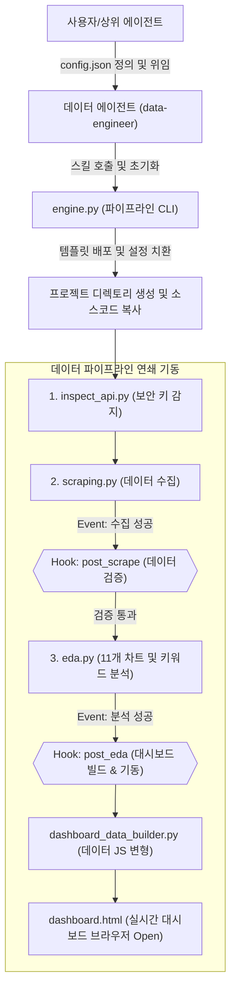
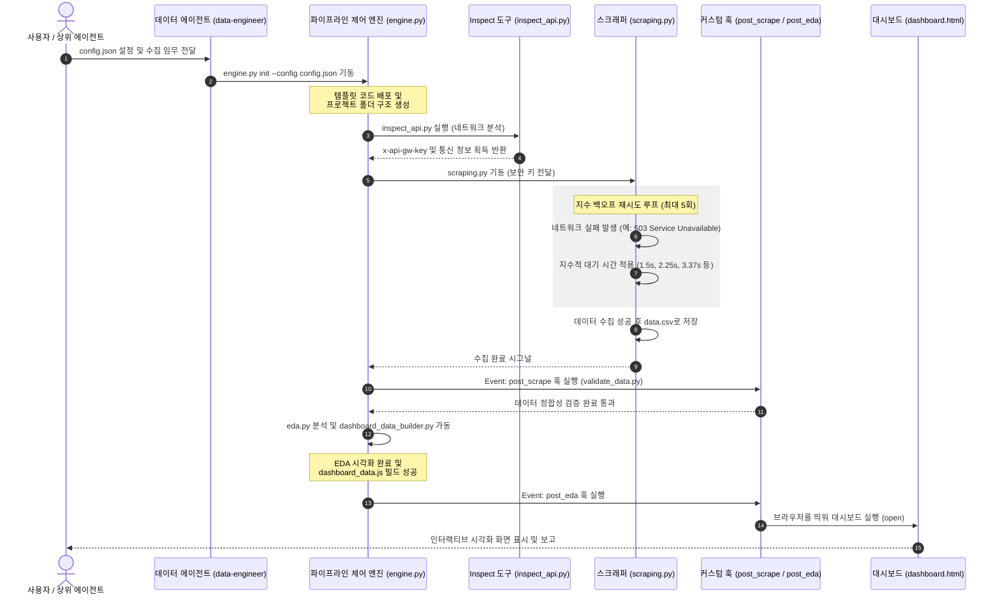

# 범용 데이터 파이프라인 프레임워크 구축 구현 계획

교보문고 및 YES24의 수집/분석/대시보드 개발 성공 사례를 추상화하여, 향후 어떠한 신규 사이트에도 즉시 데이터 파이프라인(Inspect -> Scrape -> EDA -> Dashboard)을 자동 구축해주는 범용 프레임워크(Rule, Skill, Workflow, Hook, Agent)를 설계하고 구현합니다.

## User Review Required

> [!NOTE]
> - **프레임워크 핵심 뼈대**: 사용자 또는 에이전트가 `config.json` 설정 파일(대상 URL, 헤더 매칭 키워드, 수집 필드 목록 등)만 정의하면, CLI 제어 스크립트가 템플릿 코드를 조합하여 맞춤형 데이터 수집 및 대시보드를 연쇄 기동(Workflow Hook)하도록 자동화합니다.
> - **설치 위치**: 모든 소스코드, 템플릿 및 스킬 지침서는 `.agents/skills/data-pipeline-framework` 하위에 배치되어, 향후 언제 어디서나 에이전트가 스킬로 탑재해 사용할 수 있도록 설계합니다.
> - **규칙(Rule) 강제**: `.agents/rules/data-pipeline.md` 파일을 통해 신규 사이트 수집 프로젝트 착수 시 에이전트가 따라야 할 가상환경 사용법, 데이터 구조, 한글 처리 규칙을 강제합니다.

---

## 1. 프레임워크 설계 아키텍처 및 흐름도

Mermaid 다이어그램을 통해 범용 에이전트가 설정을 주입받아 자동으로 템플릿 코드를 배포하고, 이벤트 훅을 통해 데이터 파이프라인을 연쇄 기동시키는 오케스트레이션 과정을 도식화합니다.



---

## 2. 훅 (Hook) 시스템 설계 및 동적 실행 예시

파이프라인 제어 엔진(`engine.py`)의 실행 흐름 중 특정 이벤트가 완료되면, `config.json`에 지정된 사용자의 커스텀 훅 스크립트를 동적으로 호출하여 연쇄 작업을 수행(Workflow Hooking)합니다.

### 훅 실행 시나리오 예시
1. **`post_scrape` (수집 완료 훅)**: 스크래핑이 끝나 데이터 CSV가 적재되면, `validate_data.py` 훅을 실행하여 결측치 비율 및 컬럼 정합성을 검증합니다. 만약 200위 전체가 누락되었거나 결측 비율이 50%를 초과하면 즉시 예외를 발생시키고 실행을 중단합니다.
2. **`post_eda` (분석 완료 훅)**: 데이터 EDA 시각화가 성공적으로 끝나 `images/`에 차트들이 저장되면, `dashboard_data_builder.py` 훅을 호출해 프론트엔드 데이터인 `dashboard_data.js`를 자동 생성하고 로컬 브라우저에서 `dashboard.html`을 즉시 open합니다.
3. **`on_failure` (장애 대응 훅)**: 네트워크 타임아웃이나 재시도 한도 초과 등으로 수집이 실패한 경우, `notify_error.py` 훅을 구동해 관리자 이메일이나 메신저로 즉시 알림을 발송합니다.

### config.json 훅 및 재시도 설정 예시
```json
{
  "project_name": "kyobobooks",
  "target_url": "https://store.kyobobook.co.kr/...",
  "retry_config": {
    "max_retries": 5,
    "backoff_factor": 1.5,
    "retry_on_status": [429, 500, 502, 503, 504]
  },
  "hooks": {
    "post_scrape": "python src/validate_data.py",
    "post_eda": "python src/dashboard_data_builder.py && open src/dashboard.html",
    "on_failure": "python src/notify_error.py"
  }
}
```

---

## 3. 에이전트 (Agent) 시스템 스펙 설계 및 구동 예시

전문 데이터 엔지니어 역할을 담당할 서브에이전트의 구동 명세를 JSON 규격 스펙으로 설계하여, 메인 에이전트가 언제든 해당 역할을 위임하여 파이프라인을 구축하도록 유도합니다.

### 에이전트 선언 스펙: `data-engineer.json` 예시
```json
{
  "name": "data-engineer",
  "role": "Data Pipeline Auto-Engineer",
  "system_prompt": "당신은 신규 웹사이트를 대상으로 데이터 파이프라인(API 탐색, 수집, EDA, 대시보드)을 자동 설계 및 구현하는 전문 데이터 엔지니어입니다. 반드시 '.agents/rules/data-pipeline.md' 규칙을 준수하여 가상환경 및 폴더 구조를 생성하고, '.agents/skills/data-pipeline-framework' 스킬 엔진을 활용하여 파이프라인을 연쇄 가동해야 합니다.",
  "skills": [
    "data-pipeline-framework"
  ],
  "required_rules": [
    "data-pipeline"
  ]
}
```

---

## 4. 하네스 데이터 오케스트레이션 시퀀스 다이어그램

데이터 에이전트와 파이프라인 엔진, 수집/분석 스크립트 및 훅이 상호작용하며 데이터를 순차 처리하는 상세 라이프사이클을 표현합니다.



---

## 5. 프레임워크 자체 분석 및 보완점 (5대 제안)

프레임워크의 자율성과 현업 이식성을 한층 더 높이기 위해 향후 아래 5가지 요소를 순차적으로 보완합니다:

1. **지수 백오프 기반 에러 핸들링 및 재시도 메커니즘 (반영 완료)**:
   - 429(Too Many Requests), 503(Service Unavailable) 등의 일시적 서버 이상 시 지정된 곱절 계수로 시간을 벌며 자동 재시도하는 로직을 엔진과 스크래퍼에 필수 내장합니다.
2. **로그인 세션 및 자격증명(Credentials) 관리**:
   - ID/PW 로그인 또는 Cookie 전달이 필수적인 웹사이트 대응을 위해 `config.json`에 `credentials` 암호화 마스킹 구조를 보완할 예정입니다.
3. **다중 카테고리 병렬 비동기 수집 (Parallel Scraping)**:
   - 여러 분야를 일괄 수집하여 하나의 통합 대시보드를 구축할 수 있게 비동기 멀티태스킹 런타임을 추가할 계획입니다.
4. **대시보드 레이아웃 및 테마 커스텀(Chart Theme Customizer)**:
   - `config.json`에서 직접 그래프 종류(Line, Radar 등)와 주요 HSL 톤을 덮어씌워 사이트 도메인에 부합하는 커스텀 테마 대시보드를 생성합니다.
5. **증분 업데이트(Incremental Update) 및 이중 적재 정책**:
   - 데이터 중복을 제거하며 기존 CSV의 뒷부분에 날짜별로 덧붙여서 트렌드를 보존하는 `append` 모드를 추가 설계합니다.

---

## Proposed Changes

### .agents/rules

---

#### [NEW] [data-pipeline.md](../../.agents/rules/data-pipeline.md)
신규 데이터 파이프라인 개발 시 폴더 구조(data, src, images, docs, reports), 공통 `.venv` 가상환경 재사용, 예외 처리 설계 및 한글 인코딩(`utf-8-sig`) 규칙을 강제하는 개발 룰(Rule) 파일입니다.

---

### .agents/skills/data-pipeline-framework

---

#### [NEW] [SKILL.md](../../.agents/skills/data-pipeline-framework/SKILL.md)
범용 파이프라인 프레임워크의 사용법과 실행 절차를 정의하는 스킬(Skill) 설명서 파일입니다.

#### [NEW] [engine.py](../../.agents/skills/data-pipeline-framework/engine.py)
설정 파일(`config.json`)을 읽어서 프로젝트 폴더 및 5가지 템플릿 파일들을 대상 경로에 복사하고, 설정된 메타데이터를 소스코드 템플릿에 맞춤 치환 주입하여 연쇄 가동하는 CLI 파이프라인 엔진 소스코드(Workflow & Hook)입니다.

#### [NEW] [inspect_api_template.py](../../.agents/skills/data-pipeline-framework/templates/inspect_api_template.py)
Playwright 기반의 동적 네트워크 API 감지기 템플릿입니다.

#### [NEW] [scraping_template.py](../../.agents/skills/data-pipeline-framework/templates/scraping_template.py)
보안 키 동적 캡처 및 Requests 기반 다이렉트 고속/방어 수집기 템플릿입니다.

#### [NEW] [eda_template.py](../../.agents/skills/data-pipeline-framework/templates/eda_template.py)
11개 시각화 차트 및 TF-IDF 텍스트 키워드 분석 자동 수행 템플릿입니다.

#### [NEW] [dashboard_data_builder_template.py](../../.agents/skills/data-pipeline-framework/templates/dashboard_data_builder_template.py)
대시보드 호스팅 주입용 데이터 프리프로세서 템플릿입니다.

#### [NEW] [dashboard_template.html](../../.agents/skills/data-pipeline-framework/templates/dashboard_template.html)
Bento Grid 기반의 다크/라이트 실시간 모드 스위치 지원 모던 웹앱 대시보드 템플릿입니다.

---

### .agents/agents

---

#### [NEW] [data-engineer.json](../../.agents/agents/data-engineer.json)
전문 데이터 파이프라인 자동화 서브에이전트의 역할(System Prompt) 및 필수 사용 규칙, 장착 스킬 명세를 선언하는 JSON 메타데이터 파일입니다.

---

### harness/docs

---

#### [NEW] [task.md](task.md)
프레임워크 및 에이전트 설계 구축 진행 사항을 추적할 수 있도록 새롭게 배정된 태스크 대장입니다.

---

## Verification Plan

### Automated Tests
1. **프레임워크 자동 배포 및 연쇄 기동 테스트**:
   - 가상의 모의 설정 파일(`test_config.json`)을 생성하여 아래 엔진 커맨드를 가동합니다.
   ```bash
   uv run python .agents/skills/data-pipeline-framework/engine.py init --config test_config.json
   ```
   - 정상적으로 폴더가 생성되고 템플릿 코드들이 커스텀 주입/생성되는지 검증합니다.
2. **에이전트 지침서 및 룰 활성 검증**:
   - 신규 룰 파일이 Git 상태에서 정상 노출되는지 점검합니다.

### Manual Verification
- 에이전트가 새로 작성한 스킬 지침(`SKILL.md`)을 읽고 다른 도메인을 다루는 `Data Agent` 역할을 정확하게 인식하여 지시사항을 완수할 수 있는지 확인합니다.
