# iHerb 비타민 D 데이터베이스 분석 및 EDA 보고서

본 보고서는 iHerb 비타민 D 관련 제품 데이터베이스(`iherb_vitamind.sqlite`)의 구조를 머메이드 ERD(Entity Relationship Diagram)로 시각화하고, 데이터 탐색적 분석(EDA, Exploratory Data Analysis)을 진행하여 도출된 주요 인사이트를 정리한 리포트입니다.

---

## 1. 데이터베이스 구조 및 ERD

데이터베이스는 제품 기본 정보를 담은 `products` 테이블과 상세 정보를 포함한 `product_details` 테이블로 구성되어 있으며, `product_id` 필드를 매개로 1대N 혹은 1대1 관계를 맺고 있습니다. (현재 상세 데이터는 18개 제품에 대해서만 수집되어 있습니다.)

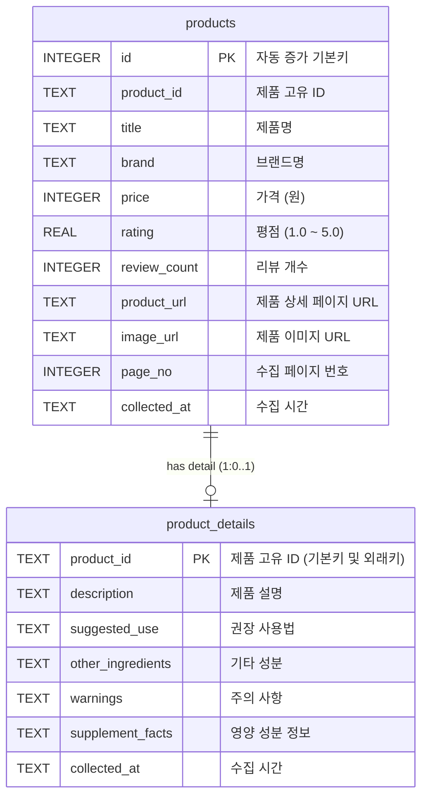

---

## 2. 데이터 탐색 기초 (기본 데이터 파악)

### 데이터셋 크기 및 결측치 정보
- **products 테이블**: 총 666행, 11열
- **product_details 테이블**: 총 18행, 7열
- **중복 행**: 양쪽 테이블 모두 중복 행 없음 (`df.duplicated().sum() == 0`)

#### 수치형 변수 기술통계량

|       |    price |     rating |   review_count |
|:------|---------:|-----------:|---------------:|
| count |    666   | 659        |          659   |
| mean  |  25567.5 |   4.80941  |         7508   |
| std   |  17738   |   0.122918 |        33015.9 |
| min   |   3721   |   3.7      |            1   |
| 25%   |  14829.8 |   4.8      |           99.5 |
| 50%   |  21347.5 |   4.8      |          551   |
| 75%   |  30173.5 |   4.9      |         2323   |
| max   | 189269   |   5        |       321016   |

> [!NOTE]
> - **가격(price)**: 평균 가격은 약 25,567원이며, 최소 3,721원부터 최대 189,269원까지 매우 다양하게 분포하고 있습니다. 표준편차가 약 17,738원으로 제품 간 가격 차이가 큰 편입니다.
> - **평점(rating)**: 평균 평점은 4.81로 전체적으로 매우 높은 만족도를 보이고 있으며, 중앙값(50%) 역시 4.8입니다. 가장 낮은 평점도 3.7로 준수한 수준입니다.
> - **리뷰 수(review_count)**: 평균 리뷰 수는 7,508개에 달하지만, 중앙값은 551개로 몇몇 메가 히트 상품들이 리뷰 수 평균을 크게 끌어올리고 있음을 알 수 있습니다. 최대 리뷰 수는 무려 321,016개입니다.

#### 범주형 변수 기술통계량

|        | brand   | product_id   |
|:-------|:--------|:-------------|
| count  | 666     | 666          |
| unique | 148     | 666          |
| top    | Carlson | CGN-02333    |
| freq   | 35      | 1            |

> [!NOTE]
> - **브랜드(brand)**: 총 148개의 고유 브랜드가 입점해 있으며, 가장 제품 등록 수가 많은 브랜드는 `Carlson`으로 총 35개의 상품이 등록되어 있습니다.
> - **제품 ID(product_id)**: 666개 제품 모두 고유한 ID를 지니고 있어 기본 식별자 역할을 훌륭히 수행합니다.

---

## 3. 변수별 특화 분석 및 시각화 (11개 차트 분석)

### 3.1. 일변량 분석 (Univariate Analysis)

#### 3.1.1. 제품 가격 분포
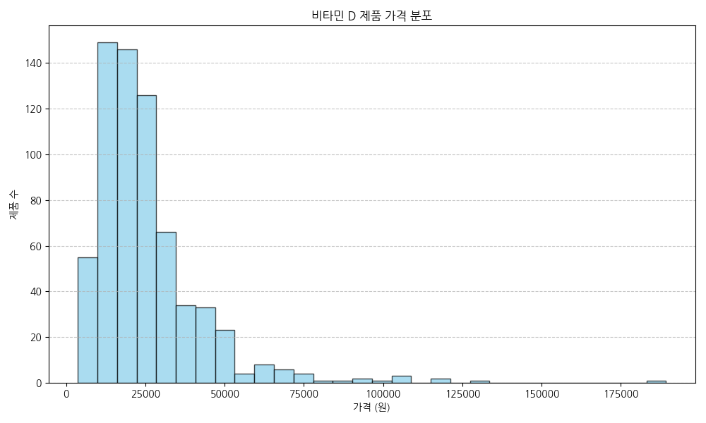
- **분석 및 해석**: 가격 분포는 1만 원대에서 3만 원대 사이에 가장 밀집되어 있는 전형적인 오른쪽 꼬리가 긴(Right-Skewed) 분포를 보입니다. 5만 원 이상의 프리미엄 제품군도 일부 존재합니다.

#### 3.1.2. 평점 분포
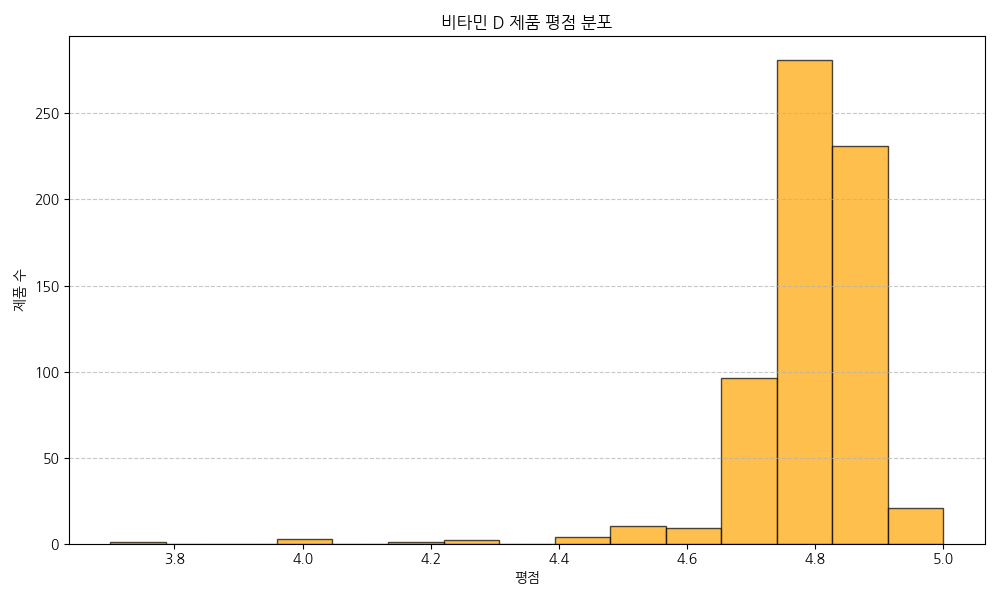
- **분석 및 해석**: 대부분의 제품이 4.5에서 5.0 사이의 극단적인 고평가 영역에 분포해 있습니다. 비타민 D 카테고리 전반에 걸친 구매자 만족도가 전반적으로 매우 우수함을 나타냅니다.

#### 3.1.3. 리뷰 수 분포 (Boxplot)
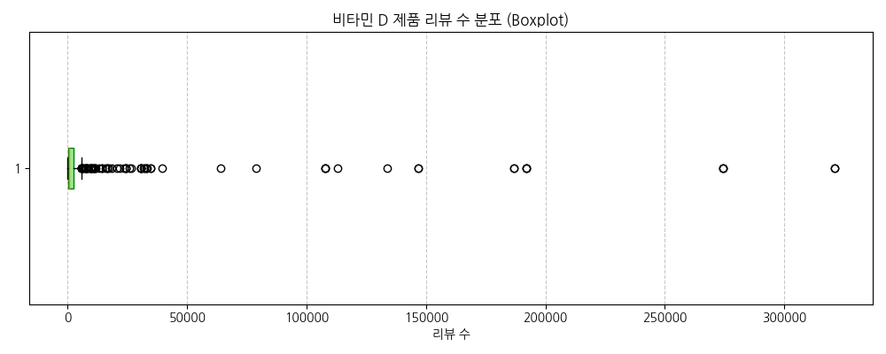
- **분석 및 해석**: 리뷰 수는 0에 가깝게 쏠려 있는 반면, 수십만 개의 리뷰를 가진 극단적인 아웃라이어(Outlier)들이 다수 확인됩니다. 시장을 독점하는 소수의 스테디셀러 제품이 존재함을 뜻합니다.

---

### 3.2. 이변량 분석 (Bivariate Analysis)

#### 3.2.1. 상위 20개 브랜드별 제품 평균 가격
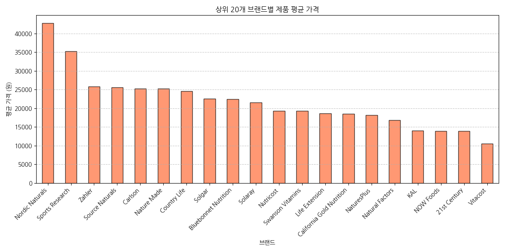
- **분석 및 해석**: 상위 20개 인기 브랜드 중에서도 브랜드 포지셔닝에 따라 평균 가격 편차가 큽니다. 일부 브랜드는 프리미엄 가격 전략을 취하는 반면, 대중적인 가성비 브랜드도 뚜렷이 구분됩니다.

#### 3.2.2. 상위 20개 브랜드별 등록 제품 수
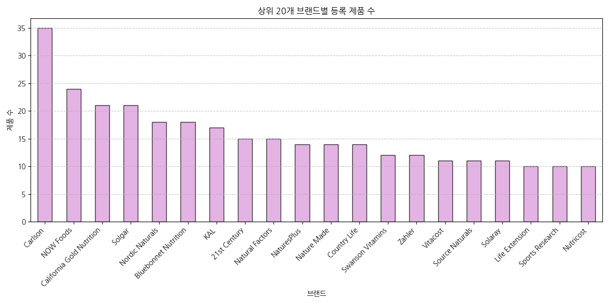
- **분석 및 해석**: `Carlson`, `NOW Foods`, `Solgar`, `California Gold Nutrition` 등이 제품 라인업을 다양하게 보유하여 시장 점유를 꾀하고 있습니다.

#### 3.2.3. 제품 가격 vs 평점 상관관계
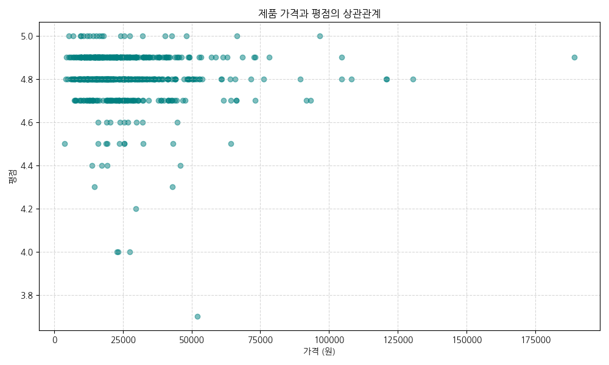
- **분석 및 해석**: 가격와 평점의 산점도를 보면, 저가 상품부터 고가 상품까지 평점이 넓게 분포하고 있어 "비싼 제품일수록 평점이 더 높다"는 선형적 인과관계는 관찰되지 않습니다.

#### 3.2.4. 제품 가격 vs 리뷰 수 상관관계
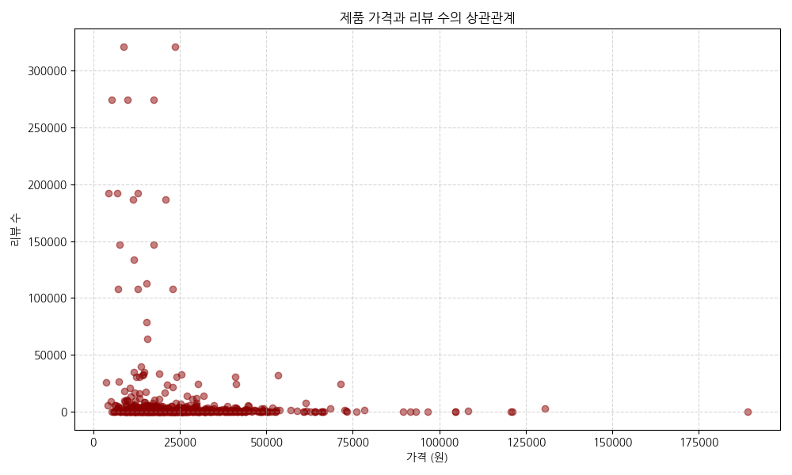
- **분석 및 해석**: 리뷰가 수만 건 이상 집중되는 인기 제품들은 대부분 1만 원~4만 원 사이의 합리적인 가격대에 포진해 있습니다. 너무 비싼 제품은 판매량(리뷰 수) 측면에서 한계가 있음을 시사합니다.

#### 3.2.5. 제품 평점 vs 리뷰 수 상관관계
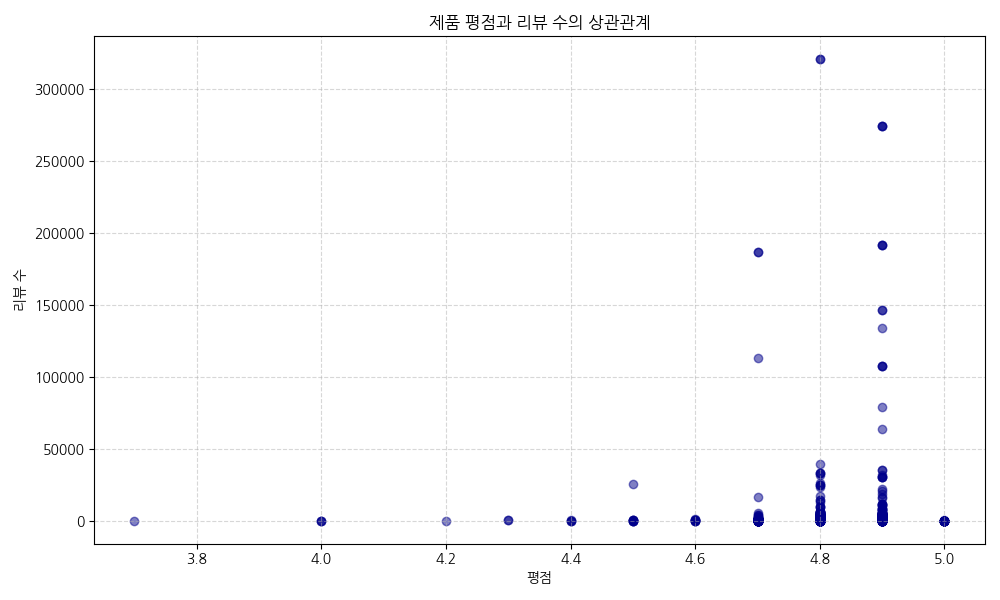
- **분석 및 해석**: 리뷰 수가 많은 베스트셀러 상품일수록 평점이 4.5~4.9 사이에 조밀하게 모여 있어, 대중적으로 검증된 높은 품질 수준을 유지하고 있음을 알 수 있습니다.

---

### 3.3. 다변량 분석 (Multivariate Analysis)

#### 3.3.1. 수치형 변수 간 상관계수 히트맵
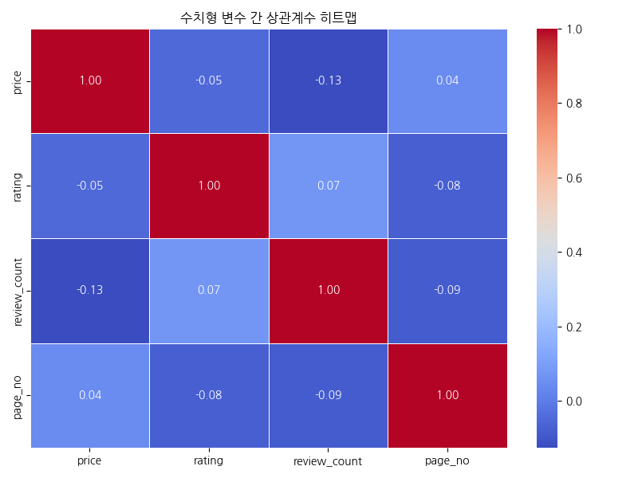
- **분석 및 해석**: 변수 간 피어슨 상관계수를 분석한 결과, 가격-평점(-0.06), 가격-리뷰수(-0.08) 등 대부분의 지표 간 선형 상관관계가 매우 낮게(0에 가깝게) 나타났습니다. 이는 소비자 의사결정이 단일 요인이 아닌 복합적 요인으로 이루어짐을 보여줍니다.

#### 3.3.2. 평점 그룹별 평균 가격 vs 평균 리뷰 수 (버블 차트)
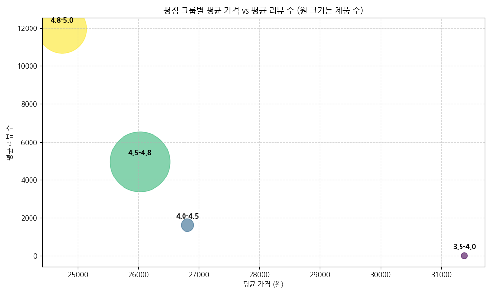
- **분석 및 해석**: 평점 4.5~4.8 구간의 제품군이 평균 리뷰 수(인기도)가 가장 높으며 평균 가격대는 약 24,000원 선에 형성되어 있습니다. 4.8~5.0 구간은 만족도는 최고이나 상대적으로 평균 리뷰 수가 적어 매니악하거나 신규 등록된 고만족도 제품 위주일 가능성이 있습니다.

---

### 3.4. 텍스트 분석 (TF-IDF 중요 키워드)

#### 3.4.1. 제품 타이틀 핵심 키워드 상위 30개
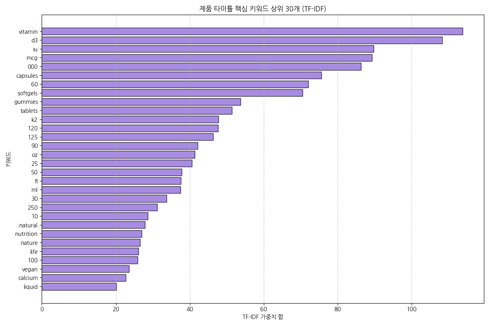

##### 타이틀 상위 30개 키워드 가중치 표
| keyword   |   weight | keyword   |   weight |
|:----------|---------:|:----------|---------:|
| vitamin   | 113.854  | 25        |  40.5371 |
| d3        | 108.296  | 50        |  37.7923 |
| iu        |  89.6805 | fl        |  37.6651 |
| mcg       |  89.3184 | ml        |  37.4896 |
| 000       |  86.2591 | 30        |  33.7029 |
| capsules  |  75.5425 | 250       |  31.2594 |
| 60        |  72.0299 | 10        |  28.673  |
| softgels  |  70.5097 | natural   |  27.863  |
| gummies   |  53.6811 | nutrition |  26.962  |
| tablets   |  51.4153 | nature    |  26.5576 |
| k2        |  47.7389 | life      |  26.1795 |
| 120       |  47.7036 | 100       |  25.8528 |
| 125       |  46.3152 | vegan     |  23.6205 |
| 90        |  42.1634 | calcium   |  22.6962 |
| oz        |  41.4094 | liquid    |  20.1786 |

- **분석 및 해석**: `vitamin`, `d3`와 같은 카테고리 핵심 키워드가 가장 압도적인 가중치를 보입니다. 또한 함량을 나타내는 단위인 `iu`, `mcg`, `000`(예: 5,000 IU, 10,000 IU 등)과 제형을 뜻하는 `capsules`, `softgels`, `gummies`, `tablets`, `liquid` 등이 고르게 주요 키워드로 추출되어 소비자가 제품 형태와 성능 수치를 타이틀에서 직관적으로 식별할 수 있도록 명명되어 있음을 증명합니다.
