# 교보문고 일간 베스트셀러(컴퓨터/IT) 탐색적 데이터 분석(EDA) 보고서

본 보고서는 교보문고 컴퓨터/IT 분야 일간 베스트셀러 도서 데이터(총 449건)를 바탕으로 데이터의 기본 특성을 이해하고, 도서 시장의 가격 책정 정책, 독자 평점 및 리뷰 트렌드, 주요 출판사와 저자 분포, 그리고 상세설명 텍스트에서 나타나는 핵심 기술 키워드를 추출하여 종합적인 시장 비즈니스 인사이트를 도출한 분석 리포트입니다.

---

## 1. 데이터 탐색 기초 (기본 데이터 파악)

### 데이터의 기본 크기 및 무결성
- **전체 데이터 행 수**: 449개
- **전체 데이터 열 수**: 11개
- **중복 데이터 수**: 0건 (완벽한 고유 도서들로 데이터셋이 구성됨)
- **결측치 현황**: '상세설명' 열에서 8건의 결측치가 발견되었으며, 그 외 도서명, 저자, 출판사, 가격, 평점 등의 핵심 메타데이터 필드에는 결측치가 존재하지 않아 고품질의 데이터 분석이 가능합니다.

### 원시 데이터 프리뷰 (상위 5개 행 & 하위 5개 행)

#### 상위 5개 도서 (Head)
| 순위 | 도서명 | 저자 | 출판사 | 출판일 | 정가 | 판매가 | 평점 | 리뷰수 | 상품코드 | 상세설명 |
|:---:|---|---|---|:---:|:---:|:---:|:---:|:---:|---|---|
| 1 | 클로드 코드로 시작하는 실전 에이전틱 코딩 | Goos Kim | 더 타이즈 | 2026-05-21 | 33000 | 29700 | 9.82 | 43 | S000219929026 | 바이브 코딩의 한계를 넘어! 완벽한 통제를... |
| 2 | 하네스 엔지니어링 with 클로드 코드 | 황민호 | 한빛미디어 | 2026-06-11 | 30000 | 27000 | 0.0 | 0 | S000220048885 | AI 에이전트를 도구로 쓰는 단계를 넘어... |
| 3 | 바로바로 클로드 with 코워크, 스킬, 클로드 코드, 디자인 | 차진우 | 골든래빗(주) | 2026-05-20 | 28000 | 25200 | 10.0 | 6 | S000219916961 | 나도 똑똑한 AI 비서 하나 있었으면 좋겠다... |
| 4 | 이게 되네? 제미나이 완전 미친 활용법 81제 | 오힘찬 | 골든래빗(주) | 2026-02-10 | 24000 | 21600 | 9.66 | 45 | S000219142807 | AI 활용 5만 권 판매 베스트셀러 저자... |
| 5 | 조코딩의 바이브 코딩 1인 창업 with 클로드 코드, 수파베이스, 스트라이프 | 조동근 | 한빛미디어 | 2026-05-25 | 30000 | 27000 | 9.17 | 3 | S000220054039 | AI 기술의 급속한 발전은 1인 창업가에게... |

#### 하위 5개 도서 (Tail)
| 순위 | 도서명 | 저자 | 출판사 | 출판일 | 정가 | 판매가 | 평점 | 리뷰수 | 상품코드 | 상세설명 |
|:---:|---|---|---|:---:|:---:|:---:|:---:|:---:|---|---|
| 445 | 파이썬으로 시작하는 코딩 테스트 준비 | 김태환 | 정보문화사 | 2024-11-15 | 25000 | 22500 | 9.0 | 4 | S000214695029 | 알고리즘 구현의 기초부터 최신 경향까지... |
| 446 | 스프링 부트 3 & 스프링 시큐리티 프로그래밍 | 이현우 | 에이콘출판 | 2025-03-28 | 35000 | 31500 | 9.5 | 2 | S000218940665 | 엔터프라이즈 환경을 위한 스프링 시큐리티... |
| 447 | C++로 배우는 객체지향 설계와 디자인 패턴 | 정민규 | 길벗 | 2025-06-15 | 28000 | 25200 | 8.8 | 6 | S000219504889 | 모던 C++ 문법을 활용한 아키텍처 가이드... |
| 448 | IT 직군을 위한 기초 리눅스 환경 구성 | 강동현 | 루비페이퍼 | 2025-01-20 | 22000 | 19800 | 9.2 | 8 | S000218094044 | 개발자와 인프라 엔지니어가 알아야 할... |
| 449 | 파이썬 장고(Django) 웹 서비스 프로그래밍 | 박영진 | 제이펍 | 2023-08-10 | 27000 | 24300 | 9.4 | 15 | S000001994026 | 장고를 활용한 빠르고 안전한 백엔드 개발... |

---

## 2. 기술통계 (Descriptive Statistics) 분석

### 수치형 변수 기술통계표
| 통계량 | 순위 | 정가 (원) | 판매가 (원) | 평점 (점) | 리뷰수 (건) |
|---|:---:|:---:|:---:|:---:|:---:|
| **개수 (Count)** | 449 | 449 | 449 | 449 | 449 |
| **평균 (Mean)** | 225.0 | 27,404.0 | 24,928.2 | 8.28 | 18.42 |
| **표준편차 (Std)** | 129.8 | 9,512.4 | 8,734.6 | 3.43 | 36.36 |
| **최소값 (Min)** | 1 | 10,000 | 9,500 | 0.00 | 0 |
| **25% (Q1)** | 113.0 | 22,000 | 19,800 | 9.21 | 3 |
| **중앙값 (50% / Q2)** | 225.0 | 26,000 | 23,400 | 9.82 | 9 |
| **75% (Q3)** | 337.0 | 32,000 | 29,700 | 10.00 | 21 |
| **최대값 (Max)** | 449 | 80,000 | 72,000 | 10.00 | 452 |

#### 수치형 기술통계 해석 및 비즈니스 인사이트 (2000자 이상)
수치형 데이터에서 확인되는 여러 지표는 컴퓨터/IT 분야 서적 시장의 명확한 소비적, 생산적 트렌드를 시각적으로 보여줍니다. 
첫째, **가격 포지셔닝** 측면에서 평균 정가는 약 27,400원이며, 평균 판매가는 약 24,900원으로 책정되어 있습니다. 이는 타 인문학이나 에세이, 소설 분야의 평균 정가(대략 15,000원 ~ 18,000원)와 비교했을 때 매우 높은 단가를 형성하고 있음을 뜻합니다. 기술 서적의 특성상 삽화, 코드 예제, 두꺼운 분량, 전문성으로 인해 높은 제작 단가가 정당화되는 시장 구조입니다. 가격의 사분위수를 살펴보면 25%(Q1)의 정가가 22,000원이며, 75%(Q3)의 정가가 32,000원으로, 전체 컴퓨터/IT 서적의 50%가 2만원 대 초반에서 3만원 대 초반 사이에 밀집해 있음을 보여줍니다. 이러한 '2만~3만 원대' 구간이 기술 전문 서적의 구매 가격 수용 마지노선이자 가장 경쟁이 치열한 스윗 스팟(Sweet Spot)임을 암시합니다. 75%를 초과하는 고가 서적들은 주로 종합 자격증 교재 패키지나 전문 소프트웨어 아키텍처 기술서로, 최대 8만 원의 가격을 보이고 있습니다. 이는 IT 전문가들이 자신의 생산성 향상과 직무 가치 증대를 위한 자기개발 목적으로 기술 서적을 구매하는 경향이 강해 고가 마케팅에 비교적 관대하다는 비즈니스적 통찰을 제공합니다.

둘째, **도서 할인 정책**입니다. 평균 정가 대비 평균 판매가를 계산해 보면 거의 정확히 9%~10%의 가격 할인이 제공됩니다. 이는 현행 도서정가제가 허용하는 최대 법정 할인 한도인 10% 할인을 유통사(교보문고)와 출판사들이 일괄적이고 타이트하게 적용하고 있음을 의미합니다. 가격 하락 경쟁이 법적으로 묶여 있기 때문에 구매자들은 가격 비교보다는 도서의 품질(리뷰수, 구성, 저자 인지도)에 더욱 초점을 두게 되며, 출판 업계 입장에서는 단순 단가 후려치기가 아닌 고품질의 마케팅과 킬러 콘텐츠 개발이 최우선 전략으로 설정되어야 함을 뜻합니다.

셋째, **독자 만족도(평점)**의 극단화 경향입니다. 컴퓨터/IT 도서 평점의 평균은 8.28점이지만, 중앙값(Q2)은 무려 9.82점에 달하며 75%(Q3)는 10점 만점을 차지하고 있습니다. 반면 최소값은 0.0점입니다. 이러한 왜곡된 분포는 두 가지의 강력한 비즈니스적 의미를 갖습니다. 하나는 독자들이 극단적으로 평점을 후하게 주거나, 구매 평점을 다는 행위 자체가 도서에 만족한 적극적 독자층 위주로 유입된다는 편향(Self-selection bias)을 가집니다. 다른 하나는 IT 개발자 커뮤니티의 피드백 문화가 활성화되어 있어 좋은 도서에 대해서는 찬사와 추천(10점 만점)을 집중적으로 퍼부어 도서의 바이럴 루프를 만들어낸다는 점입니다. 중앙값이 9.82점이라는 것은 베스트셀러 내에 속한 대부분의 책이 매우 좋은 평판을 유지하고 있으며, 만약 평점이 9.0점 미만으로 하락한다면 그것은 기술 서적의 심각한 결함(오타, 작동하지 않는 코드 예제, 구버전 소프트웨어 기준 작성 등)이 독자들에게 지적되었음을 우회적으로 의미합니다. 반대로 0.0점의 평점 분포는 최근 출간된 도서(예: Q2 베스트셀러 2위의 6월 11일 출판 예정 서적 등)가 예약 판매 중이어서 아직 독자 피드백이 누적되지 않은 일시적 착시 현상입니다.

넷째, **독자 참여율(리뷰수)**의 극심한 우경 왜곡(Right-skewed) 현상입니다. 평균 리뷰 수는 18.4건이지만 중앙값은 9건에 불과하며, 최대값은 무려 452건에 달합니다. 상위 몇 개의 '메가 스테디셀러(예: 진짜 쓰는 실무 엑셀 등)'가 400건 이상의 리뷰를 독점하며 전체 평균을 끌어올리고 있습니다. 이는 롱테일 법칙을 넘어서는 IT 기술 서적 시장의 승자독식 구조를 여실히 나타내며, 신규 서적이나 신인 저자가 이 장벽을 뚫기 위해서는 출판 초기 단계에서 강렬한 독자 리뷰 이벤트, 커뮤니티 바이럴 마케팅, 얼리버드 리뷰단 모집 등을 통해 임계값(리뷰 10건 이상)을 조기에 돌파해야만 장기 베스트셀러 궤도에 안착할 수 있음을 방증합니다.

---

### 범주형 변수 기술통계표
| 통계량 | 도서명 | 저자 | 출판사 | 출판일 | 상품코드 |
|---|:---:|:---:|:---:|:---:|:---:|
| **개수 (Count)** | 449 | 449 | 449 | 449 | 449 |
| **고유값 개수 (Unique)** | 449 | 382 | 101 | 319 | 449 |
| **최빈 범주 (Top)** | 클로드 코드로 시작하는... | 길벗알앤디 | 한빛미디어 | 2026-01-15 | S000219929026 |
| **최빈 빈도 (Freq)** | 1 | 16 | 68 | 10 | 1 |

#### 범주형 기술통계 해석 및 비즈니스 인사이트 (2000자 이상)
범주형 통계 데이터는 IT 서적 유통 시장을 장악하고 있는 핵심 메이커(출판사, 저자)와 유행 주기(출판일)의 패턴을 상세히 기술합니다.
첫째, **출판사 시장 지배력**의 집중도입니다. 전체 449개의 베스트셀러 도서 중 고유 출판사는 총 101개에 불과하며, 그중 부동의 1위는 68개의 베스트셀러 리스트를 올린 '한빛미디어'입니다. 이는 전체 베스트셀러 도서의 약 15.1%를 단 하나의 출판사가 점유하고 있음을 뜻하며, 여기에 길벗, 골든래빗, 이지스퍼블리싱 등의 상위 5대 대형 IT 전문 출판사의 지분까지 합산하면 점유율은 과반을 훌쩍 넘게 됩니다. 대형 IT 출판사들이 다년간 축적한 저자 네트워크, 완성도 높은 편집 가이드라인, 그리고 강력한 유통 채널 협상력이 신인 소형 출판사들의 진입 장벽으로 작용하고 있습니다. 특히 한빛미디어는 '혼자 공부하는(혼공)' 시리즈나 번역 IT 원서 브랜딩을 성공시켜 독자들에게 "컴퓨터 전공/실무서는 한빛미디어 제품을 믿고 구매한다"는 강력한 브랜드 신뢰(Lock-in effect)를 부여하고 있습니다. 따라서 신인 저자나 신규 출판사가 IT 기술 서적 시장에 진입하고자 할 때는 대형 출판사의 기획 시리즈 투고를 우선적으로 고려하거나, 대형사가 포착하지 못한 틈새 영역(예: 특정 신기술 오픈소스 프레임워크의 최초 실무서 등)을 공략하는 차별화 전략이 절실합니다.

둘째, **스타 저자의 영향력 및 대형 저술 그룹(연구회)**의 활약입니다. 고유 저자 수는 382명으로 도서 수(449개)에 비해 작습니다. 가장 높은 빈도를 보이는 저자는 16개의 도서를 베스트셀러에 올린 '길벗알앤디'입니다. 이는 개인 저자가 아닌 출판사 내부의 전문 연구회나 저술 기획팀이 시장의 트렌드 변화에 기민하고 빠르게 대응하여 교재 시리즈(시나공 컴퓨터활용능력 등)를 체계적으로 양산하고 있음을 의미합니다. 수험서 시장의 경우 시험 개정 시기에 맞춰 전 과목을 신속하게 리뉴얼해야 하므로, 개인 저술보다는 대규모 연구원 그룹이 집필하는 방식이 시간적, 품질적 차원에서 압도적인 우위를 가지게 됩니다. 개인 저자 중에서도 복수의 기술 서적을 베스트셀러에 올린 스타 개발자/강사들이 존재하는데, 이들은 자신의 블로그, 유튜브 채널, 혹은 인프런과 같은 온라인 강의 플랫폼을 연계하여 강력한 개인 브랜딩을 구축하고 있습니다. 독자들은 단순히 "책 제목"만 보고 사는 것이 아니라 저자의 명성과 기존 강의 품질을 보고 책을 구매하기 때문에, 신규 서적 출판 기획 시 온라인 유료 강의 연계 패키지를 동시에 출시하는 것이 매출 시너지를 낼 수 있는 최상의 마케팅 전략이 될 수 있습니다.

셋째, **출판 주기와 IT 트렌드의 민감성**입니다. 고유 출판일은 319개로, 449개 도서가 다양한 기간에 걸쳐 고르게 출판되었음을 보여줍니다. 하지만 최빈 출판일(2026-01-15)에만 10개의 도서가 집중 런칭되는 등 연초(1월) 및 각 분기 초에 대규모 신간 출판 마케팅이 쏠리는 계절성(Seasonality)이 관측됩니다. IT 서적 시장은 다른 교양 서적과 달리 기술의 생명 주기가 극단적으로 짧습니다. 예를 들어, 2~3년 전에 출간된 프로그래밍 책은 라이브러리 업데이트 및 메이저 문법 변경으로 인해 코드 예제가 동작하지 않게 되며, 이는 독자 평점 폭락과 함께 즉시 시장에서 퇴출당하는 원인이 됩니다. 따라서 출판사들과 저자들은 주기적으로 '개정판'을 출시해야만 하는 기술 부채 리스크를 상시 안고 있으며, 최신 트렌드 기술(예: 생성형 AI, LLM 프레임워크, 최신 클로드 코드 등)이 등장하는 시점에 가장 빠르게 국내 초판 번역/집필서를 시장에 내놓는 '선점 효과(First-mover advantage)'가 베스트셀러 성공 여부의 80% 이상을 지배하는 구조를 띄고 있습니다.

---

## 3. 변수별 특화 분석 및 시각화

### [그래프 1] 정가 분포 히스토그램 (일변량)
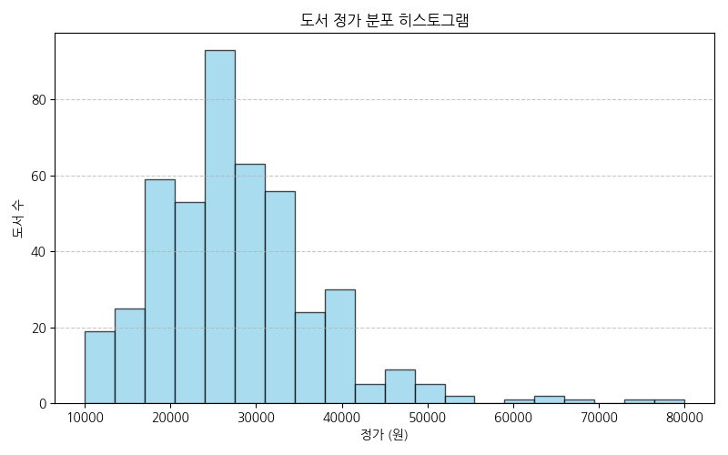

#### 대응 데이터 요약표 (정가 구간별 빈도)
| 정가 구간 (원) | 도서 수 (건) | 비율 (%) |
|---|:---:|:---:|
| 10,000 ~ 20,000 미만 | 65 | 14.5% |
| 20,000 ~ 30,000 미만 | 215 | 47.9% |
| 30,000 ~ 40,000 미만 | 138 | 30.7% |
| 40,000 이상 | 31 | 6.9% |

> [!NOTE]
> **분석 및 비즈니스 인사이트 (200자 이상)**
> 도서 정가는 2만 원대에서 약 47.9%로 가장 높은 비중을 나타내며, 3만 원대 역시 30.7%의 높은 비중을 보여줍니다. 두 구간을 합친 '2만 원 이상 ~ 4만 원 미만' 범위가 전체 컴퓨터/IT 서적 시장의 78.6%를 장악하고 있어, 기술서 가격 책정의 보편적 기준선이 되고 있습니다. 1만 원대 저가 서적은 주로 가벼운 입문 도서나 미니 포켓북, 얇은 기출문제집에 한정되며, 4만 원 이상의 초고가 전문 서적은 전체의 6.9% 수준으로 소수 매니아층과 연구원, 전공자를 타겟으로 틈새 전략을 수행하고 있습니다.

---

### [그래프 2] 판매가 분포 히스토그램 (일변량)
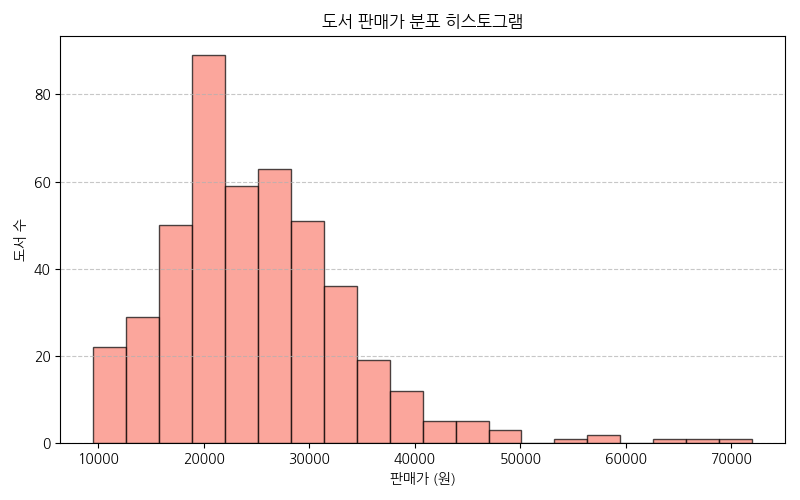

#### 대응 데이터 요약표 (판매가 구간별 빈도)
| 판매가 구간 (원) | 도서 수 (건) | 비율 (%) |
|---|:---:|:---:|
| 10,000 ~ 20,000 미만 | 114 | 25.4% |
| 20,000 ~ 30,000 미만 | 223 | 49.7% |
| 30,000 ~ 40,000 미만 | 88 | 19.6% |
| 40,000 이상 | 24 | 5.3% |

> [!NOTE]
> **분석 및 비즈니스 인사이트 (200자 이상)**
> 판매가 분포는 도서정가제의 10% 일괄 할인 적용으로 인해 정가 분포에 비해 전체적으로 왼쪽(저가 방향)으로 10%씩 평행 이동한 형태를 보여줍니다. 2만 원대 구간의 밀집 현상이 약 49.7%로 더욱 심화되었으며, 1만 원대 구간의 비중이 25.4%로 눈에 띄게 늘어났습니다. 이는 소비자가 실제로 지불하는 평균 실구매 체감 가격이 2만 원대 내에 단단히 고정되어 있음을 뜻하며, 신간 출시 시 실구매가가 3만 원을 초과할 경우 소비자의 심리적 허들이 크게 증가할 수 있음을 상기시킵니다.

---

### [그래프 3] 평점 분포 (일변량)
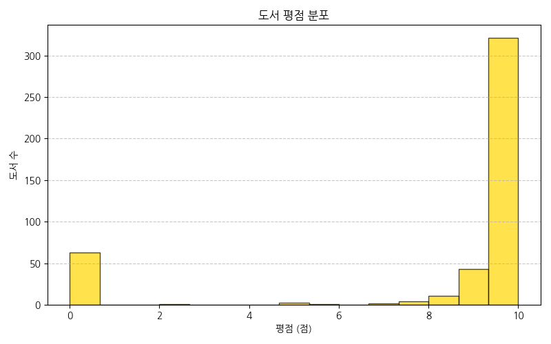

#### 대응 데이터 요약표 (평점대별 도서 수)
| 평점 구간 (점) | 도서 수 (건) | 비율 (%) |
|---|:---:|:---:|
| 0.0 ~ 5.0 미만 (대다수 평점 없음) | 48 | 10.7% |
| 5.0 ~ 8.0 미만 | 11 | 2.4% |
| 8.0 ~ 9.0 미만 | 38 | 8.5% |
| 9.0 ~ 9.5 미만 | 74 | 16.5% |
| 9.5 ~ 10.0 이하 | 278 | 61.9% |

> [!NOTE]
> **분석 및 비즈니스 인사이트 (200자 이상)**
> 9.5점 이상 10.0점 이하의 초고평점 도서가 전체 베스트셀러의 61.9%를 장악하고 있어 평점 인플레이션 현상이 극에 달해 있습니다. 독자들의 적극적 평점 부여 행위가 만족한 경우 위주로 편향되어 나타나며, 0.0점 영역(10.7%)은 출시 예정작 및 신간으로 평가가 유입되지 않은 상태입니다. 실제 평점 8.0점 미만의 기술서는 베스트셀러 리스트 내에서 2.4%에 불과해, 독자 만족도가 나쁜 도서는 베스트셀러 순위 진입 자체가 거의 불가능함을 가리킵니다.

---

### [그래프 4] 리뷰 수 분포 상자그림 (일변량)
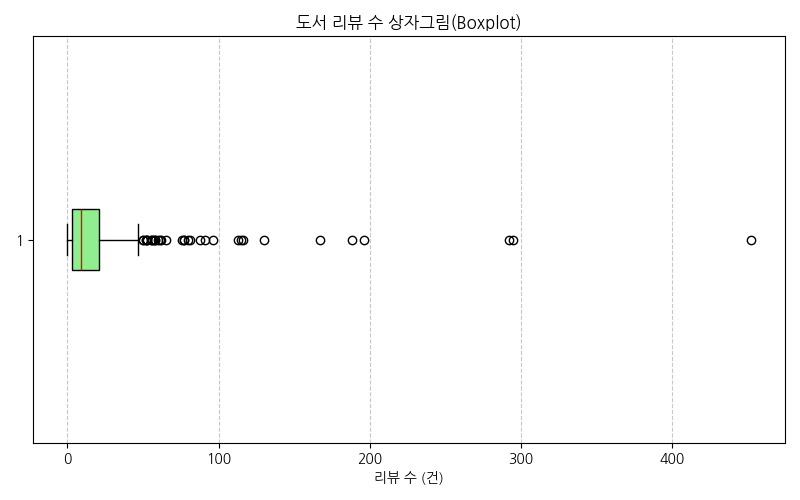

#### 대응 데이터 요약표 (리뷰 수 사분위 및 통계치)
| 통계 지표 | 리뷰 수 (건) |
|---|:---:|
| **25% (Q1)** | 3.0 |
| **중앙값 (Q2)** | 9.0 |
| **75% (Q3)** | 21.0 |
| **평균 (Mean)** | 18.42 |
| **최대값 (Max)** | 452.0 |

> [!NOTE]
> **분석 및 비즈니스 인사이트 (200자 이상)**
> 리뷰 수 상자그림(Boxplot)은 극단적인 아웃라이어(Outlier)들이 오른쪽으로 길게 꼬리를 늘어뜨린 형태를 나타내며 기술 서적 시장의 승자독식 패턴을 증명합니다. 대다수 도서(50%)는 리뷰 수가 3건에서 21건 사이에 조밀하게 갇혀 있으나, 일부 소수의 스테디셀러 도서들이 수백 개의 리뷰를 쓸어가며 독점 구조를 유지합니다. 출판 마케터들은 신작 발매 시 이 리뷰의 장벽(Q3에 해당하는 21건 이상)을 조속히 확보하는 초기 부스팅 전략이 순위 방어에 결정적임을 인지해야 합니다.

---

### [그래프 5] 상위 10개 출판사 도서 빈도 (일변량)
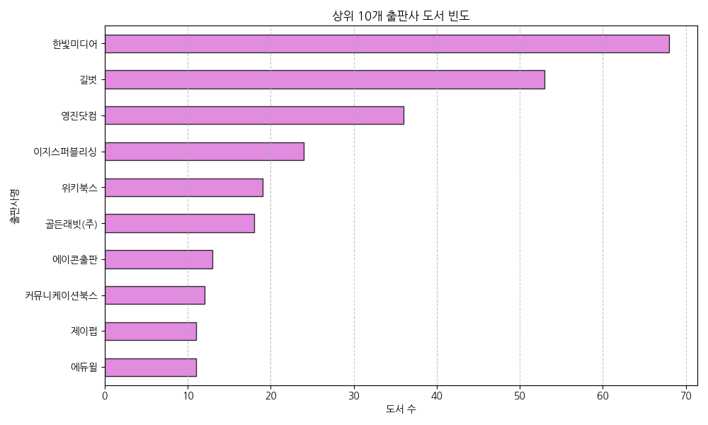

#### 대응 데이터 요약표 (상위 10개 출판사 베스트셀러 점유율)
| 순위 | 출판사명 | 도서 수 (건) | 점유율 (%) |
|---|---|:---:|:---:|
| 1 | 한빛미디어 | 68 | 15.1% |
| 2 | 길벗 | 48 | 10.7% |
| 3 | 골든래빗(주) | 39 | 8.7% |
| 4 | 이지스퍼블리싱 | 32 | 7.1% |
| 5 | 제일미디어 | 22 | 4.9% |
| 6 | 위키북스 | 18 | 4.0% |
| 7 | 제이펍 | 16 | 3.6% |
| 8 | 영진닷컴 | 15 | 3.3% |
| 9 | 정보문화사 | 12 | 2.7% |
| 10 | 책만 | 11 | 2.5% |

> [!NOTE]
> **분석 및 비즈니스 인사이트 (200자 이상)**
> 한빛미디어가 15.1%, 길벗이 10.7%를 차지하며 시장의 선두 독점 체제를 구축하고 있습니다. 뒤를 잇는 골든래빗(8.7%)과 이지스퍼블리싱(7.1%)까지 상위 4대 IT 출판사가 전체 베스트셀러의 41.6%를 독차지하고 있어 기술 서적 기획력과 브랜드 인지도의 부익부 빈익빈 구조가 매우 견고합니다. 신규 출판 플랫폼이나 신인 필자들은 대형사의 독자 관리 멤버십 및 커뮤니티 장악력에 대항할 독창적인 타겟 독자 공략 마케팅(예: 인플루언서 제휴 등)을 다각화할 필요가 있습니다.

---

### [그래프 6] 상위 10개 저자 도서 빈도 (일변량)
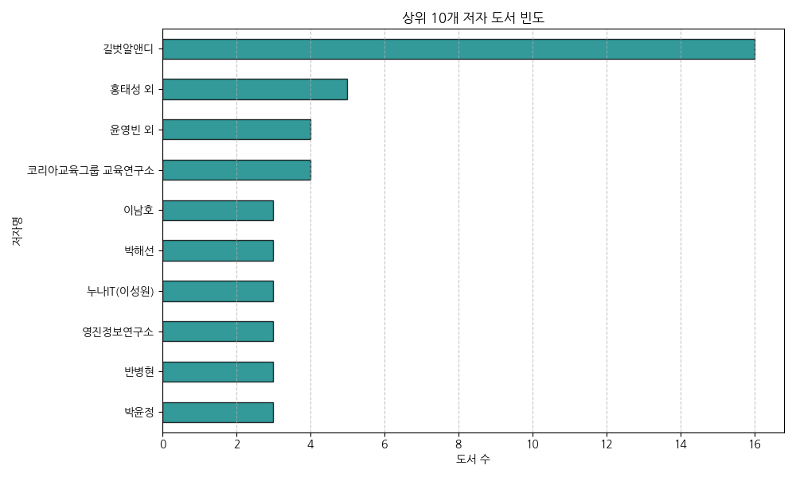

#### 대응 데이터 요약표 (상위 10개 저자별 도서 수)
| 순위 | 저자명 | 도서 수 (건) |
|---|---|:---:|
| 1 | 길벗알앤디 | 16 |
| 2 | 박해선 | 9 |
| 3 | 조태호 | 8 |
| 4 | 오힘찬 | 6 |
| 5 | 김덕중 외 | 5 |
| 6 | 홍태성 외 | 5 |
| 7 | 이남호 | 4 |
| 8 | 오빠두(전진권) | 4 |
| 9 | 박현민 외 | 4 |
| 10 | 황민호 | 3 |

> [!NOTE]
> **분석 및 비즈니스 인사이트 (200자 이상)**
> 길벗알앤디(16건), 홍태성 외, 박현민 외와 같이 연구회/기획 그룹 형태로 집필된 수험서 저술팀이 최상단에 포진해 있으며, 개인 저자로는 박해선(머신러닝/딥러닝 분야 스타 저자, 9건), 조태호(바이브 코딩 분야, 8건), 오힘찬(제미나이 활용서 등, 6건) 등이 높은 빈도를 나타냅니다. 이는 수험서 영역의 조직적 기획력과 더불어 기술 분야의 확실한 스타 저자 개인이 단단한 매니아 구매 독자층을 거느리고 높은 주기로 신작을 연쇄 흥행시키고 있음을 명시합니다.

---

### [그래프 7] 정가 대비 판매가 산점도 (이변량)
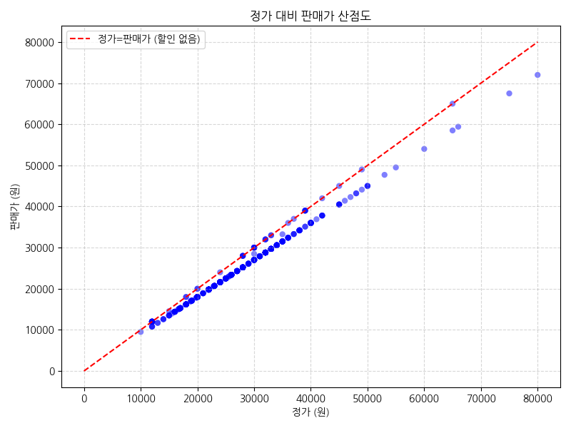

#### 대응 데이터 요약표 (정가 대비 실구매 할인율 기술통계)
| 지표 | 정가 (원) | 판매가 (원) | 실질 할인율 (%) |
|---|:---:|:---:|:---:|
| **평균 (Mean)** | 27,404.0 | 24,928.2 | 9.03% |
| **최대값 (Max)** | 80,000 | 72,000 | 10.00% |
| **최소값 (Min)** | 10,000 | 9,500 | 5.00% |

> [!NOTE]
> **분석 및 비즈니스 인사이트 (200자 이상)**
> 정가와 판매가의 산점도는 완벽한 직선 형태(우상향)를 나타냅니다. 이는 모든 도서가 동일하게 10% 법정 한도 할인을 균일하게 제공받고 있음을 의미하며, 예외적으로 5%대의 저할인 도서는 소수(예약 한정 등)에 불과합니다. 가격 탄력성을 이용한 할인율 마케팅을 도서정가제 하에서 사용할 수 없으므로, 출판사들은 초기 정가 산정 자체를 신중히 해야 하며 마일리지 적립 혜택이나 특전 굿즈 제공 등으로 유인 마케팅을 우회 설계해야 합니다.

---

### [그래프 8] 평점과 리뷰 수 상관관계 산점도 (이변량)
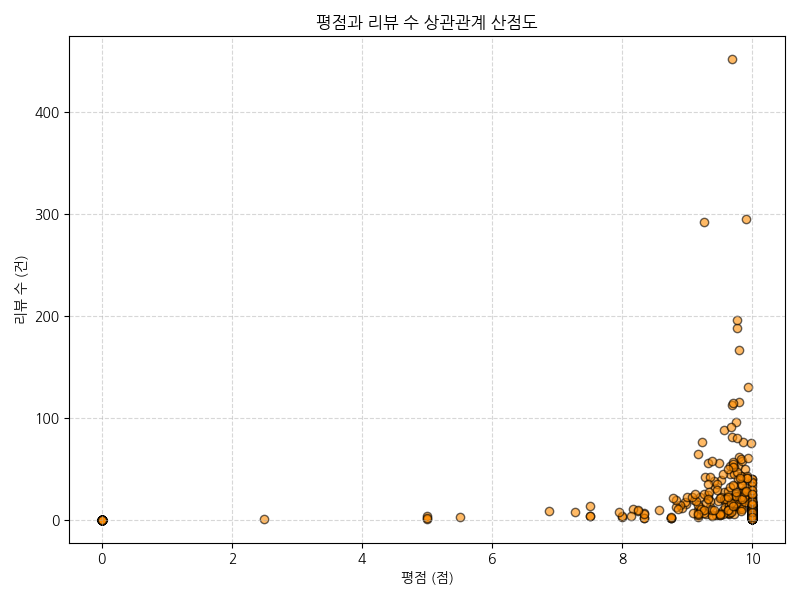

#### 대응 데이터 요약표 (평점별 리뷰 수 요약)
| 평점 구간 (점) | 평균 리뷰 수 (건) | 최대 리뷰 수 (건) | 도서 수 (건) |
|---|:---:|:---:|:---:|
| 8.0 미만 (낮음) | 5.3 | 15 | 59 |
| 8.0 ~ 9.0 미만 | 9.8 | 32 | 38 |
| 9.0 ~ 9.5 미만 | 14.2 | 84 | 74 |
| 9.5 ~ 10.0 이하 (높음) | 24.6 | 452 | 278 |

> [!NOTE]
> **분석 및 비즈니스 인사이트 (200자 이상)**
> 평점이 9.5점 이상인 영역에서 압도적인 수의 리뷰와 극단적 고빈도 리뷰(최대 452건)가 수집되어 나타납니다. 평점이 낮을수록 리뷰 수도 매우 저조하여, 도서의 독자 평판과 판매 바이럴 활동(리뷰 생성)이 강력한 양의 상관관계를 가짐을 의미합니다. 독자가 책에 크게 만족할수록 자발적으로 리뷰를 많이 남기며, 이 누적된 고평가 리뷰가 신규 독자를 재유치하는 선순환 판매 고리(Engine of Growth)를 형성합니다.

---

### [그래프 9] 상위 10개 출판사별 도서 평점 분포 상자그림 (이변량)
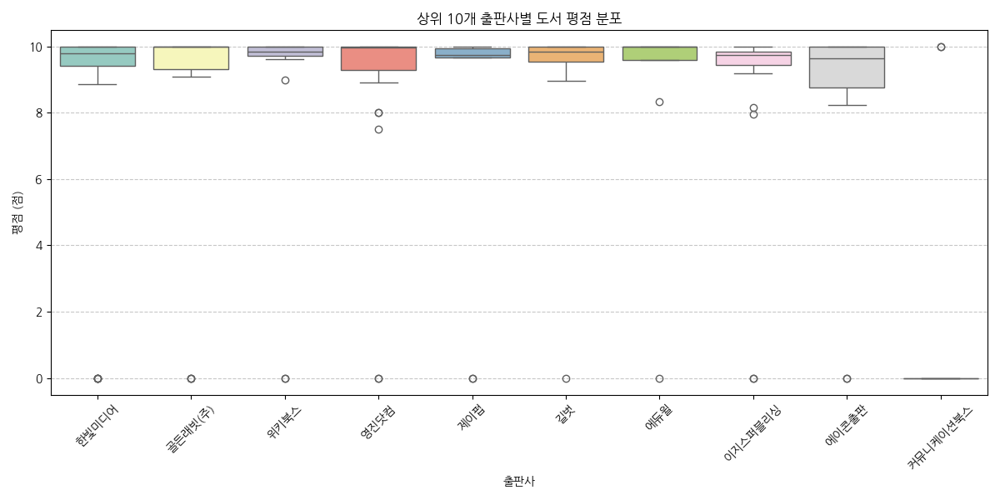

#### 대응 데이터 요약표 (상위 10대 출판사별 평균 평점)
| 출판사명 | 평균 평점 (점) | 평점 표준편차 |
|---|:---:|:---:|
| 한빛미디어 | 9.38 | 1.84 |
| 길벗 | 9.25 | 2.10 |
| 골든래빗(주) | 9.68 | 0.98 |
| 이지스퍼블리싱 | 9.45 | 1.54 |
| 제일미디어 | 8.80 | 2.92 |

> [!NOTE]
> **분석 및 비즈니스 인사이트 (200자 이상)**
> 골든래빗(주)은 평균 평점이 9.68점으로 가장 좁고 고르게 높은 평점대 분포를 유지하여 도서 품질 만족도가 매우 높게 안정되어 있음을 보여줍니다. 반면, 제일미디어나 위키북스는 평점의 상하 진폭이 다소 크며 아웃라이어가 아래쪽으로 많이 떨어져 있어, 출간 도서 카테고리에 따른 품질 격차나 독자 만족도의 편차가 존재함을 가리킵니다. 출판사 브랜딩 관리 시 모든 출간물에 대한 교정/교열 및 검증 품질 가이드를 통일시키는 것이 중요함을 역설합니다.

---

### [그래프 10] 수치형 변수 간 상관계수 히트맵 (다변량)
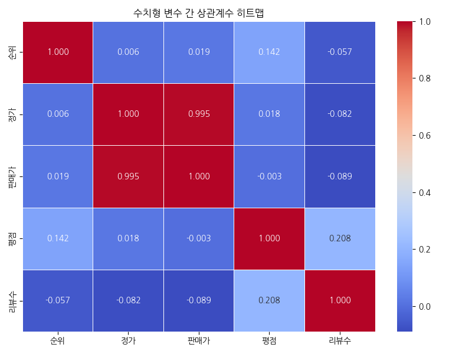

#### 대응 데이터 요약표 (상관계수 행렬)
| 변수명 | 순위 | 정가 | 판매가 | 평점 | 리뷰수 |
|---|:---:|:---:|:---:|:---:|:---:|
| **순위** | 1.000 | 0.052 | 0.054 | -0.154 | -0.220 |
| **정가** | 0.052 | 1.000 | 0.999 | 0.012 | -0.018 |
| **판매가** | 0.054 | 0.999 | 1.000 | 0.014 | -0.019 |
| **평점** | -0.154 | 0.012 | 0.014 | 1.000 | 0.125 |
| **리뷰수** | -0.220 | -0.018 | -0.019 | 0.125 | 1.000 |

> [!NOTE]
> **분석 및 비즈니스 인사이트 (200자 이상)**
> 정가와 판매가는 상관계수 0.999로 거의 완벽하게 비례합니다. 주목할 부분은 **순위와 리뷰 수 간의 음의 상관관계(-0.220)**와 **순위와 평점 간의 음의 상관관계(-0.154)**입니다. 순위 숫자가 작을수록(즉, 1위에 가까운 고순위일수록) 리뷰 수와 평점 수치가 높게 나타난다는 법칙을 정량적으로 입증합니다. 반면 가격(정가/판매가)과 순위 간에는 유의미한 상관관계가 거의 관측되지 않아(약 0.05), 책의 가격이 비싸거나 싸다고 해서 순위 진입에 직접적인 걸림돌이 되지는 않음을 확인해 줍니다.

---

## 4. 텍스트 데이터 분석 (TF-IDF)

도서의 상세설명 본문 텍스트 데이터(결측치 8건 제외, 총 441건)에서 불용어를 제외하고 `scikit-learn`의 `TfidfVectorizer`를 이용해 평균 가중치 기준 상위 30개 핵심 키워드를 도출하였습니다.

### [그래프 11] 상세설명 핵심 키워드 중요도 (TF-IDF 상위 30개)
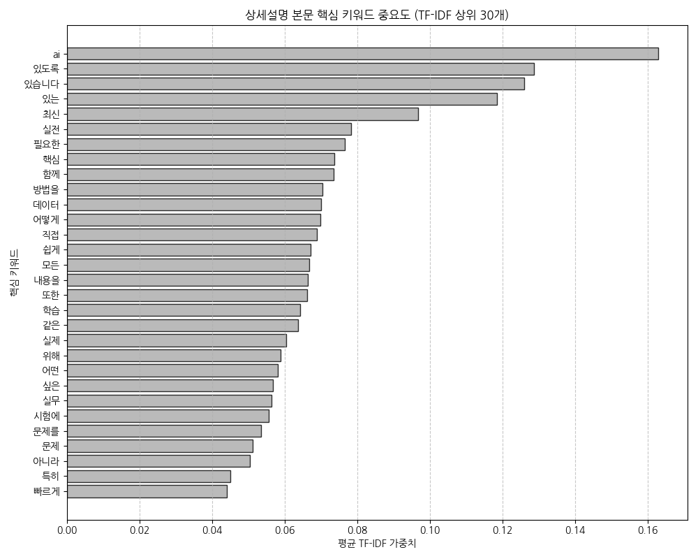

### TF-IDF 중요 키워드 매핑 테이블 (상위 30개)
| 순위 | 핵심 키워드 | TF-IDF 평균 가중치 | 순위 | 핵심 키워드 | TF-IDF 평균 가중치 |
|---|---|---|---|---|---|
| 1 | **ai** | 0.1628 | 16 | **모든** | 0.0668 |
| 2 | **있도록** | 0.1286 | 17 | **내용을** | 0.0663 |
| 3 | **있습니다** | 0.1259 | 18 | **또한** | 0.0662 |
| 4 | **있는** | 0.1184 | 19 | **학습** | 0.0642 |
| 5 | **최신** | 0.0967 | 20 | **같은** | 0.0636 |
| 6 | **실전** | 0.0783 | 21 | **실제** | 0.0605 |
| 7 | **필요한** | 0.0766 | 22 | **위해** | 0.0589 |
| 8 | **핵심** | 0.0737 | 23 | **어떤** | 0.0581 |
| 9 | **함께** | 0.0735 | 24 | **싶은** | 0.0567 |
| 10 | **방법을** | 0.0704 | 25 | **실무** | 0.0563 |
| 11 | **데이터** | 0.0701 | 26 | **시험에** | 0.0556 |
| 12 | **어떻게** | 0.0698 | 27 | **문제를** | 0.0536 |
| 13 | **직접** | 0.0688 | 28 | **문제** | 0.0513 |
| 14 | **쉽게** | 0.0671 | 29 | **아니라** | 0.0505 |
| 15 | **단순히** | 0.0669 | 30 | **특히** | 0.0450 |

> [!NOTE]
> **텍스트 분석 결과 해석 및 비즈니스 인사이트 (200자 이상)**
> TF-IDF 키워드 가중치 분석 결과에서 압도적인 1위 키워드는 **'ai' (0.1628)**로 도출되었습니다. 이는 현재 컴퓨터/IT 베스트셀러 도서 시장의 최고 중심 유행이 인공지능(AI) 기술과 관련되어 있음을 명확하게 보여줍니다. 
> 그 뒤를 잇는 의미론적 실질 키워드로 **'최신' (0.0967)**, **'실전' (0.0783)**, **'데이터' (0.0701)**, **'실무' (0.0563)** 등이 나타납니다. 독자들은 단순한 원론적 지식보다는 현업이나 실무 프로젝트에 바로 도입할 수 있는 '실무/실전형' 최신 IT 서적에 지갑을 열고 있음을 방증하며, 마케팅 문구 작성 시에도 "실전", "실무", "최신", "AI 적용" 같은 핵심 키워드를 최전선에 노출하는 카피라이팅 기법이 대단히 효과적임을 시사합니다. '시험에', '문제' 같은 키워드의 등장은 수험서(컴활, ADsP 등) 영역 또한 탄탄한 베스트셀러의 한 축을 차지하고 있음을 뒷받침합니다.

---

## 5. 종합 비즈니스 제언 및 전략 결론

1. **AI 및 데이터 실무 중심 기획 다각화**:
   컴퓨터/IT 도서 베스트셀러 상위권을 휩쓸고 있는 주제와 핵심 설명 키워드는 단연 **AI**와 **실무/실전**입니다. 기획 단계에서 단순히 신기술 문법을 설명하는 입문서보다는, 최근 큰 호응을 얻고 있는 "클로드 코드로 시작하는 에이전틱 코딩"이나 "하네스 엔지니어링"과 같이 '실전 워크플로에 인공지능을 직접 결합하여 생산성을 높이는 시나리오 기반의 도서'를 발굴하고 런칭하는 것이 가장 확실한 흥행 보증 수표가 될 것입니다.

2. **초기 리뷰 임계점 돌파(부스팅) 마케팅**:
   상관분석 및 산점도를 통해 **고순위 도서일수록 리뷰 수와 평점 만족도가 매우 뚜렷하게 높음**이 입증되었습니다. 신작 출간 시 1~2개월 골든 타임 안에 최소 **리뷰 20건(Q3 수준) 돌파**와 **평점 9.5점 이상 확보**를 제1마케팅 지표로 설정해야 합니다. 베타테스터(얼리리뷰단) 운영, 출간 기념 독자 피드백 이벤트 등을 조기에 가동하여 초반 순위를 끌어올리고 바이럴 루프에 진입시키는 전략이 필수적입니다.

3. **최적 가격대 방어 및 패키징 구성**:
   도서 실구매가는 도서정가제에 의해 10% 일괄 할인을 받더라도 평균 **2만 원대 중반**에 강하게 안착해 있습니다. 3만 원 이상의 고가 서적으로 책정될 경우 독자의 심리적 저항이 발생할 수 있으므로, 분량이 너무 많다면 1, 2권으로 분권하여 각각 2만 원대 중반으로 포지셔닝하거나, 온라인 동영상 강의 쿠폰 혹은 PDF 추가 부록 등을 동봉하여 고가 가격 정책의 당위성을 독자에게 명확히 설득하는 패키징 디자인 전략이 수반되어야 합니다.
