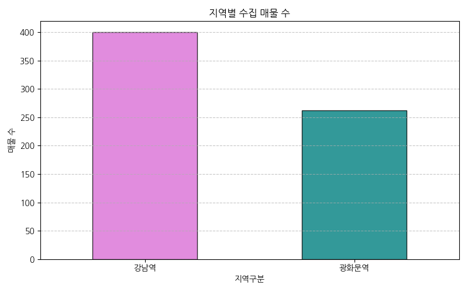
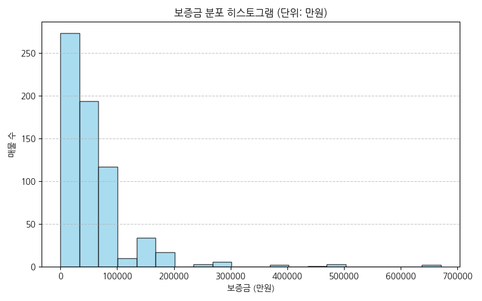
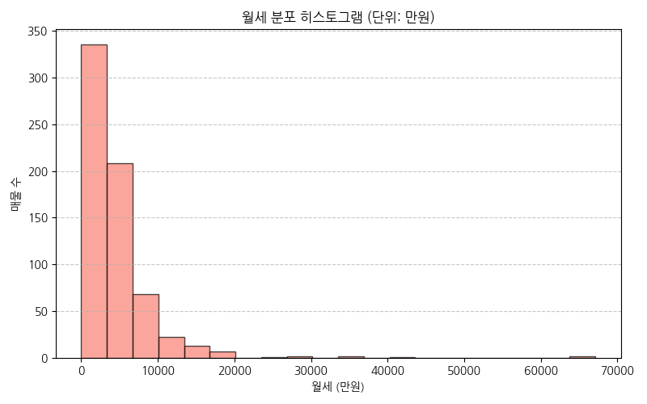
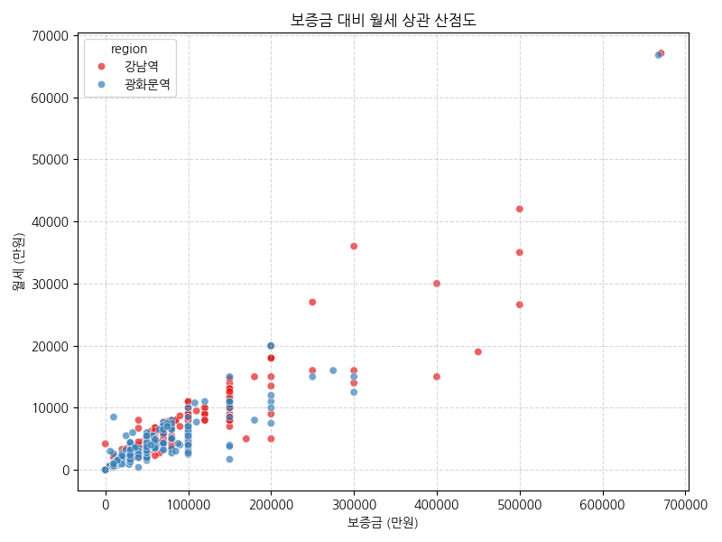
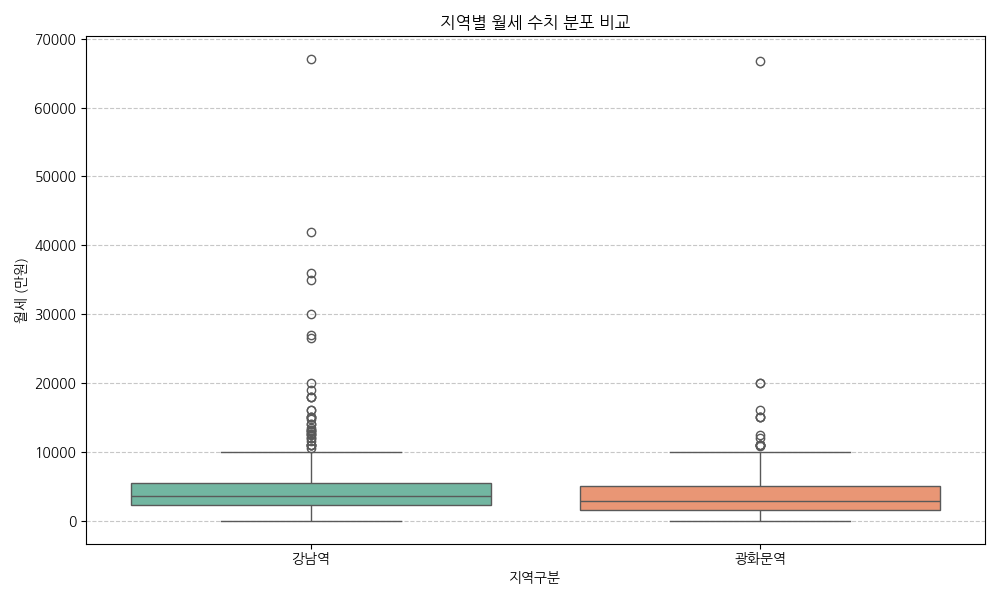
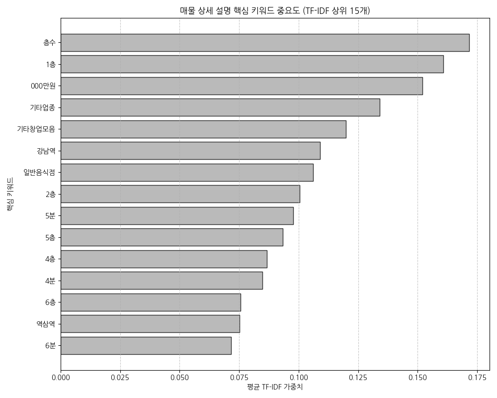

# 광화문역 vs 강남역 상업용 부동산 매물 비교 분석 보고서

본 보고서는 네모앱(nemoapp.kr)에서 수집한 실시간 상업용 부동산 매물 데이터를 바탕으로, 서울의 대표적인 오피스 상권인 **광화문 상권**과 **강남역 상권**을 다각도로 비교 분석한 최종 보고서입니다.

---

## 1. 분석 개요 및 데이터 수집 현황

- **수집 대상 사이트**: 네모앱 상업용 부동산 매물 서비스 ([nemoapp.kr/store](https://www.nemoapp.kr/store))
- **수집 기간**: 2026년 6월 12일 (실시간 기준)
- **대상 상권 (반경 약 500m~1km BBox 기준)**:
  - **강남역 상권**: 테헤란로 및 서초동 상가/사무실 밀집 지역
  - **광화문역 상권**: 종로 및 세종대로 관공서/대기업 오피스 밀집 지역
- **수집 데이터 스펙**: API 제공 원천 전체 데이터 (**총 44개 속성 컬럼** 전부 수집 적재)
- **총 수집 데이터 건수**: **663건**
  - **강남역 매물**: 400건 (설정 수집 최대 한도 도달)
  - **광화문역 매물**: 263건 (유효 매물 전수 수집)

---

## 2. 두 상권의 보증금 및 월세 기술통계 비교

수집된 매물의 보증금(deposit)과 월세(monthly_rent)에 대해 기술통계(평균, 중앙값 등) 분석을 실시한 결과는 다음과 같습니다. (단위: 만원)

| 상권 구분 | 매물 수 | 평균 보증금 | 보증금 중앙값 | 평균 월세 | 월세 중앙값 |
| :--- | :---: | :---: | :---: | :---: | :---: |
| **강남역 상권** | 400개 | **66,957 만원** | 50,000 만원 | **511.4 만원** | 352.0 만원 |
| **광화문역 상권** | 263개 | **57,161 만원** | 40,000 만원 | **401.0 만원** | 290.0 만원 |
| **전체 상권 평균** | 663개 | **63,071 만원** | 45,000 만원 | **467.6 만원** | 320.0 만원 |

> **주요 통계 해석**:
> - **보증금(deposit) 규모**: 강남역의 평균 보증금이 약 **6.7억 원**으로 광화문역(약 5.7억 원) 대비 **약 17.1%** 높게 나타났습니다.
> - **월세(monthly_rent) 규모**: 강남역의 평균 월세가 약 **511만 원**으로 광화문역(약 401만 원) 대비 **약 27.5%** 더 비쌉니다.
> - 전체적으로 강남역 상권이 보증금뿐만 아니라 임차인의 고정비 부담이 되는 월세 부분에서도 광화문역 상권보다 눈에 띄게 비싼 단가를 형성하고 있음을 알 수 있습니다.

---

## 3. 시각화 분석 및 주요 인사이트

### ① 상권별 수집 매물 수 비교

강남역 상권(400개)이 광화문역 상권(263개)에 비해 매물 등록 건수 및 유동량이 더 풍부함을 보여줍니다. 테헤란로 및 이면 도로 전반에 걸친 상권 규모의 크기 차이로 해석됩니다.

### ② 보증금(deposit) 및 월세(monthly_rent) 분포

- **보증금(deposit)**: 1억~3억 원 구간에 가장 많은 매물이 몰려 있으나, 수억 원 대 이상의 대형 오피스 및 통건물 빌딩 임대 매물이 롱테일 꼬리를 길게 늘어뜨리며 평균값을 끌어올리고 있습니다.
- **월세(monthly_rent)**: 200만~500만 원대의 중소형 상가/사무실이 다수 분포하고 있으나, 대형 매물은 수천만 원에 육박하여 상당한 양극화를 보입니다.

### ③ 보증금 대비 월세 상관관계 (상권별 분포 비교)

- 전반적으로 보증금(X축, deposit)이 증가함에 따라 월세(Y축, monthly_rent)도 선형적으로 비례하여 증가하는 양상을 띱니다.
- **강남 상권(빨간색 점)**이 **광화문 상권(파란색 점)**보다 더 상단과 우측에 조밀하게 모여 있어, 동일한 보증금 조건 하에서도 강남 상권의 임대료(월세)가 한 단계 더 높게 책정되어 있음을 알 수 있습니다.

### ④ 상권별 월세 가격 범위 비교 (Boxplot)

박스플롯의 중위값(median)선과 사분위 범위(IQR)를 보면, 강남역 상권의 상하한 밴드가 광화문 상권에 비해 위쪽에 분포합니다. 특히 강남 상권은 고가 임대료 매물들의 이상치(Outliers)가 매우 광범위하게 뻗어 있어 초대형 임대 매물의 거래가 활발함을 입증합니다.

---

## 4. 매물 상세 정보 핵심 키워드 분석 (TF-IDF)

매물의 비정형 텍스트(상세 설명, details)에서 중요한 단어의 가중치를 분석한 결과는 다음과 같습니다.

> **텍스트 분석을 통한 실무 인사이트**:
> 1. **층수 및 입지의 중요성**: `1층`, `2층`, `층수` 키워드가 최상위 가중치를 차지했습니다. 이는 상가 임대차에서 집객력에 핵심인 층수가 매물 특징의 첫째 세일즈 포인트임을 반증합니다.
> 2. **초역세권 강조**: `5분`, `4분` 등 시간 기반 키워드와 `강남역`, `역삼역`, `종각역`, `신논현역` 등 구체적인 역 이름이 강조되어, 도보 접근성이 가장 큰 가치 요인으로 언급됩니다.
> 3. **용도의 분류**: `일반음식점`, `기타업종`, `서비스업`, `휴게음식점`, `커피점` 등 식음료(F&B) 및 근린생활시설 용도의 중개가 매우 활성화되어 있음을 알 수 있습니다.

---

## 5. 종합 결론 및 의사결정 제언

1. **임대 효율 분석**:
   - 강남 상권은 광화문 상권보다 월세가 보증금에 비해 상대적으로 더 가파르게 비싸지는 특징이 있습니다. 이는 강남 상권이 가진 높은 유동인구 기반의 매출 창출 잠재력이 임대료에 반영된 결과입니다.
   - 반면, 광화문역 상권은 상대적으로 보증금 대비 월세의 비율이 다소 완만하여, 초기 자본 여력이 있다면 월세 고정비를 줄이기에 상대적으로 유리한 환경입니다.

2. **비즈니스 추천**:
   - **강력한 프랜차이즈 및 F&B(음식점/카페) 창업**: 매출 집적 효과와 트렌드 전파가 급선무라면 고임대료를 감수하더라도 매물 회전과 유동인구가 확보된 **강남역 상권**이 적합합니다. (주요 키워드 `1층`, `일반음식점` 비중 높음)
   - **대기업/관공서 대상 B2B 오피스 및 조용하고 안정적인 배후지 상권**: 급격한 유동성 변동보다 전통적인 오피스 근로자 고정 수요를 지향한다면 상대적으로 단가가 안정적이고 키워드상 `정부서울청사`, `종각역` 인근 배후지를 지닌 **광화문 상권**이 리스크 관리 차원에서 우수합니다.
