# SSG.COM 해피바이 특가 상품 데이터 분석 보고서 (EDA)

본 보고서는 SSG.COM의 대표적인 특가 코너인 **해피바이(Happybuy)**에서 1분 간격으로 총 5회에 걸쳐 수집된 310건의 특가 상품 데이터를 바탕으로 작성된 탐색적 데이터 분석(EDA) 보고서입니다. 데이터 파악, 기술 통계 분석, 키워드 텍스트 마이닝, 그리고 일변량/이변량/다변량 변수 시각화를 포함하고 있습니다.

---

## 1. 기본 데이터 파악 (Data Preview)

### 데이터셋 구조 및 형태
- **전체 데이터 크기**: 310행 × 9열
- **중복 데이터 수**: 0건
- **수집 시점 수**: 5개 시점 (각 시점별 62개 상품 수집 완료)

### 원시 데이터 프리뷰 (상위 5개 행)
|    | 상품명                              |    정상가 |   판매가 | 할인율   | 상품상세링크                                                                                                                                    | 이미지링크                                                          | 수집일시                |   할인율_수치 | 수집일시_dt             |
|---:|:---------------------------------|-------:|------:|:------|:------------------------------------------------------------------------------------------------------------------------------------------|:---------------------------------------------------------------|:--------------------|---------:|:--------------------|
|  0 | 썸머 바캉스 슈즈  최저가 도전! 슈즈MD 추천제안     | 223928 | 94050 | 58%   | https://www.ssg.com/item/dealItemView.ssg?itemId=1000788996603&siteNo=6009&salestrNo=1002&advertBidId=1020471223&advertExtensTeryDivCd=10 | https://sitem.ssgcdn.com/03/66/99/spclprc/1000788996603_sp.jpg | 2026-06-14 11:48:11 |       58 | 2026-06-14 11:48:11 |
|  1 | 플리츠특가전~UP TO 67%                 |  56050 | 44840 | 20%   | https://www.ssg.com/item/dealItemView.ssg?itemId=1000541629220&siteNo=6009&salestrNo=1002&advertBidId=1020471485&advertExtensTeryDivCd=10 | https://sitem.ssgcdn.com/20/92/62/spclprc/1000541629220_sp.jpg | 2026-06-14 11:48:11 |       20 | 2026-06-14 11:48:11 |
|  2 | 패션 BEST 50 ~67%할인                |  15900 | 14310 | 10%   | https://www.ssg.com/item/dealItemView.ssg?itemId=1000731836857&siteNo=6300&salestrNo=6005&advertBidId=1020471547&advertExtensTeryDivCd=10 | https://sitem.ssgcdn.com/57/68/83/spclprc/1000731836857_sp.jpg | 2026-06-14 11:48:11 |       10 | 2026-06-14 11:48:11 |
|  3 | 본격 여름 오픈 SALE! UP TO 89%         |  29000 | 20880 | 28%   | https://www.ssg.com/item/dealItemView.ssg?itemId=1000641521485&siteNo=6004&salestrNo=6005&advertBidId=1020471568&advertExtensTeryDivCd=10 | https://sitem.ssgcdn.com/85/14/52/spclprc/1000641521485_sp.jpg | 2026-06-14 11:48:11 |       28 | 2026-06-14 11:48:11 |
|  4 | [신세계TV쇼핑] 지금 입기 좋은 패션 제안! 에디티드 外 |  29000 | 26100 | 10%   | https://www.ssg.com/item/dealItemView.ssg?itemId=1000780800559&siteNo=6004&salestrNo=6005                                                 | https://sitem.ssgcdn.com/59/05/80/spclprc/1000780800559_sp.jpg | 2026-06-14 11:48:11 |       10 | 2026-06-14 11:48:11 |

### 원시 데이터 프리뷰 (하위 5개 행)
|     | 상품명                                          |    정상가 |    판매가 | 할인율   | 상품상세링크                                                                                    | 이미지링크                                                          | 수집일시                |   할인율_수치 | 수집일시_dt             |
|----:|:---------------------------------------------|-------:|-------:|:------|:------------------------------------------------------------------------------------------|:---------------------------------------------------------------|:--------------------|---------:|:--------------------|
| 305 | [12% 쿠폰 적용가 : 80,784원]쿠션 드 보떼 (+파우치 증정)      | 108000 |  91800 | 15%   | https://www.ssg.com/item/itemView.ssg?itemId=1000833117917&siteNo=6009&salestrNo=1013     | https://sitem.ssgcdn.com/17/79/11/spclprc/1000833117917_sp.jpg | 2026-06-14 11:52:02 |       15 | 2026-06-14 11:52:02 |
| 306 | CROIFFLE 크로플 남성 U넥 슬림 다운 자켓 경량 패딩 DMW23503   |  79000 |  66123 | 16%   | https://www.ssg.com/item/itemView.ssg?itemId=1000827495831&siteNo=6009&salestrNo=1019     | https://sitem.ssgcdn.com/31/58/49/spclprc/1000827495831_sp.jpg | 2026-06-14 11:52:02 |       16 | 2026-06-14 11:52:02 |
| 307 | 쬬르디와 콩밤이 최대 50% 할인전                          |   3300 |   3300 | nan   | https://www.ssg.com/item/dealItemView.ssg?itemId=1000833156319&siteNo=6004&salestrNo=6005 | https://sitem.ssgcdn.com/19/63/15/spclprc/1000833156319_sp.jpg | 2026-06-14 11:52:02 |        0 | 2026-06-14 11:52:02 |
| 308 | 건조분쇄형 에코웨일 큐브 2L 음식물처리기 쿠쿠 직접생산 눌음방지 화이트     | 489000 | 440100 | 10%   | https://www.ssg.com/item/itemView.ssg?itemId=1000842516228&siteNo=6004&salestrNo=6005     | https://sitem.ssgcdn.com/28/62/51/spclprc/1000842516228_sp.jpg | 2026-06-14 11:52:02 |       10 | 2026-06-14 11:52:02 |
| 309 | [레이저] Razer Basilisk V3 Pro White 무선 게이밍 마우스 | 169000 | 169000 | nan   | https://www.ssg.com/item/itemView.ssg?itemId=1000831926100&siteNo=6004&salestrNo=6005     | https://sitem.ssgcdn.com/00/61/92/spclprc/1000831926100_sp.jpg | 2026-06-14 11:52:02 |        0 | 2026-06-14 11:52:02 |

---

## 2. 기술통계 (Descriptive Statistics) 분석 및 인사이트

### 2.1 수치형 변수 기술통계
|       |     정상가 (원) |     판매가 (원) |   할인율_수치 (%) |
|:------|--------------:|---------------:|---------:|
| count |    310        |    310         | 310      |
| mean  | 205,002       | 172,297         |  17.5    |
| std   | 337,979       | 297,523         |  17.8049 |
| min   |   3,300       |   3,300         |   0      |
| 25%   |  35,000       |  26,100         |   5      |
| 50%   |  79,800       |  72,300         |  12.5    |
| 75%   | 223,928       | 195,415         |  20      |
| max   | 2,260,000     | 2,034,000       |  70      |

#### 수치형 기술통계 상세 해석 및 인사이트 (2,000자 이상)
수집된 데이터의 정상가와 판매가, 할인율 분포를 면밀히 살펴보면 SSG.COM 해피바이 코너의 비즈니스 지향점과 상품 소싱 전략을 명확하게 해석할 수 있습니다. 

첫째, 가격 편차가 매우 극단적으로 나타납니다. 정상가의 표준편차는 337,979원, 판매가의 표준편차는 297,523원에 달하여, 평균값(정상가 약 20.5만 원, 판매가 약 17.2만 원)에 비해 표준편차가 훨씬 큽니다. 이는 이 코너가 특정 균일가 상품군을 판매하는 것이 아니라, 수천 원짜리 저가 팬시 상품부터 200만 원 상당의 고가 수입 명품 및 프리미엄 가전제품(정상가 최대 226만 원, 판매가 최대 203.4만 원)까지 포괄하는 '종합 몰형 특가 플랫폼'임을 입증합니다. 

둘째, 사분위수 분석을 통해 실질적인 주력 가격대를 파악할 수 있습니다. 정상가의 중앙값(50% 지점)은 79,800원이고 판매가의 중앙값은 72,300원입니다. 반면 평균값은 정상가 기준 약 20.5만 원으로 중앙값보다 약 2.5배 가량 높습니다. 이는 전형적인 가격 데이터의 '우측 꼬리가 긴 분포(Right-Skewed Distribution)'를 보입니다. 즉, 전체 상품의 75%가 정상가 223,928원(판매가 195,415원) 이하에 밀집해 있는 반면, 상위 25% 미만의 소수 초고가 프리미엄 가전이나 패션 뷰티 명품들이 전체 평균 가격을 대폭 끌어올리고 있는 형국입니다. 실질적으로 소비자들이 해피바이 특가전에서 마주하는 상품 4개 중 3개는 20만 원 이하의 접근하기 편리한 가격대의 상품들로 채워져 있어, 충동구매를 유도하거나 합리적인 소비를 제안하는 마케팅 장치로 기능합니다.

셋째, 할인율 분포는 매우 매력적으로 조정되어 있습니다. 수집된 상품들의 평균 할인율은 17.5%입니다. 중앙값은 12.5%이며, 제3사분위수(상위 75%)는 20%입니다. 최대 할인율은 70%에 이릅니다. 이는 소비자가 인지하기에 '의미 있는 수준의 혜택'을 주기 위해 최저 5~10% 수준에서 최대 50~70%까지의 파격적인 할인을 적절히 배합하고 있음을 의미합니다. 할인율의 표준편차가 17.8%로 상당히 크다는 점은 판매 전략상 고정된 균일 할인율이 아닌, 카테고리의 마진 구조와 재고 상태에 따라 탄력적인 할인율 정책을 적용하고 있음을 증명합니다. 예컨대 패션/아웃렛 카테고리는 50%가 넘는 고할인율을 대대적으로 홍보하여 고객 유입(Traffic Generator) 역할을 수행하게 하고, 마진율이 낮거나 가격 통제가 엄격한 디지털/명품 카테고리는 5~15% 수준의 낮은 할인율을 제공하되 브랜드 가치와 쿠폰 적용가 등의 혜택을 전면에 내세워 실질 매출 볼륨(Revenue Volumizer)을 키우는 소싱 및 이원화 전략을 취하고 있는 것으로 분석됩니다.

넷째, 최솟값 가격 3,300원은 소비자가 배송비 결제 수준으로 손쉽게 장바구니에 담을 수 있는 스낵이나 생필품 종류가 소싱되었음을 시사하고, 최대 판매가 2,034,000원의 고가 제품군은 기획 특가전의 전문성과 신뢰도를 심어주는 역할을 병행합니다. 이러한 가격 및 할인 분포 구조는 플랫폼 운영진 입장에서는 마진과 객단가를 동시에 방어하면서 소비자들에게는 매번 새롭고 매력적인 딜(deal)을 제공하는 다채로운 머천다이징 전략의 결과물이라고 평가할 수 있습니다.

### 2.2 범주형 변수 기술통계
|        | 상품명                          | 할인율   | 수집일시                |
|:-------|:-----------------------------|:------|:--------------------|
| count  | 310                          | 255   | 310                 |
| unique | 61                           | 25    | 5                   |
| top    | 썸머 바캉스 슈즈  최저가 도전! 슈즈MD 추천제안 | 20%   | 2026-06-14 11:48:11 |
| freq   | 10                           | 30    | 62                  |

#### 범주형 기술통계 상세 해석 및 인사이트
범주형 데이터 분석 결과에서 가장 눈에 띄는 부분은 수집된 310건의 행 중에서 고유한 상품명의 개수가 단 61개라는 점입니다. 이는 1분 단위로 5회 수집된 데이터이므로 동일 상품이 각 시점마다 중복 수집되었음을 뜻합니다. 각 수집 시점(수집일시)별로 정확히 62개의 상품 데이터가 일관되게 수집되고 있는 구조입니다. 

가장 빈번하게 등장한 대표 상품명은 "썸머 바캉스 슈즈 최저가 도전! 슈즈MD 추천제안"으로 총 10회 등장하였습니다. 이는 1회 수집 주기 내에서도 상품 레이아웃 상 서로 다른 블록에 중복 배치되어 노출 강도를 의도적으로 극대화했거나 MD 강추 테마로 중복 편성되었음을 유추할 수 있습니다. 

할인율 범주에서는 '20%' 할인율이 30회로 가장 빈번하게 수집되어, 온라인 종합 쇼핑몰 특가 상품군에서 소비자의 심리적 장벽을 허물면서 유통 마진을 방어하는 최적의 타협점이 '20% 세일'임을 실증적으로 보여줍니다.

### 2.3 초고할인 상품군 (할인율 50% 이상) 특별 분석

전체 310건의 수집 목록(중복 제거 시 고유 상품 61종) 중 할인율이 50% 이상으로 책정되어 파격적인 혜택을 주는 상품은 단 7종(전체의 11.5%)에 불과합니다. 이들 고할인율 상품의 목록과 통계적 특성은 다음과 같습니다.

#### 할인율 50% 이상 고유 상품 목록
| 상품명 | 정상가 (원) | 판매가 (원) | 할인율 | 주요 특징 및 소싱 유형 |
| :--- | :---: | :---: | :---: | :--- |
| **터프 테라 패딩 슬리퍼 (역시즌 단독최저가)** | 69,000 | 20,528 | **70%** | 역시즌 재고 소진형 기획 딜 |
| **[럭키박스] 세안 바디 헤어 7종 세트 (본품6+증정)** | 57,000 | 19,200 | **66%** | 대량 묶음 판매 및 세트 구성 딜 |
| **썸머 바캉스 슈즈 최저가 도전! 슈즈MD 추천제안** | 223,928 | 94,050 | **58%** | 시즌 집중형 패션 MD 테마 딜 |
| **[최신제조] 영진약품 피로액F 100mlx20병 선물용** | 21,600 | 9,720 | **55%** | 대량 박스 포장 가성비 생필품 딜 |
| **[신세계백화점] 비비안웨스트우드 선글라스 3종** | 418,000 | 195,415 | **53%** | 백화점 아웃렛 연계 명품 브랜드 딜 |
| **[나이키코리아공식] 나이키 BEST 50종 모음** | 68,172 | 34,086 | **50%** | 브랜드 연합 베스트셀러 다품목 딜 |
| **내맘대로 구이세트 골라담기 (1++/1등급 등심 외)** | 79,800 | 39,900 | **50%** | 신선식품(한우) 옵션 선택형 특가 딜 |

#### 초고할인 상품군 기술 통계
- **평균 정상가**: 133,929원
- **평균 판매가**: 58,986원 (최소: 9,720원 / 최대: 195,415원)
- **평균 할인율**: 57.4%

#### 핵심 분석 인사이트
1. **집객용 미끼 상품(Loss Leader) 포지셔닝**: 전체 특가 상품의 약 11% 수준으로만 초고할인 딜을 제한적으로 노출하여, 기획전의 전체 마진율 하락을 최소화하면서도 외부 트래픽을 효율적으로 견인하는 미끼 역할을 유도하고 있습니다.
2. **소액/라이프스타일 상품 편중**: 선글라스(19.5만 원)를 제외한 상품의 판매가가 대부분 1~3만 원대로 매우 낮습니다. 단가가 낮아 마진 리스크가 적고 소비자가 가볍게 장바구니에 담을 수 있는 의류 소품, 화장품 세트, 가공식품 위주로 50% 이상의 세일 태그를 집중시키고 있습니다.
3. **가치 중심의 판촉용 기획 네이밍**: `[럭키박스]`, `역시즌 단독최저가`, `내맘대로 골라담기`와 같이 소비자에게 심리적 득템 효과와 흥미를 자극하는 키워드를 조합하여 즉각적인 마우스 클릭 및 구매 전환을 달성하도록 설계되었습니다.

---

## 3. 텍스트 마이닝 분석 (TF-IDF 핵심 키워드 추출)

KoNLPy 등의 형태소 분석기 없이 `scikit-learn`의 `TfidfVectorizer`를 사용하여 상품명 내 중요 단어 30개를 추출한 결과입니다.

| 키워드   |       가중치 | 키워드   |       가중치 |
|:------|----------:|:------|----------:|
| 특가    | 0.053413  | to    | 0.0246905 |
| 할인    | 0.047543  | 쿠폰    | 0.0238794 |
| 증정    | 0.0457854 | 인기    | 0.023413  |
| 최대    | 0.0378639 | 70    | 0.0224724 |
| 여름    | 0.0360782 | 단독    | 0.0220733 |
| 50    | 0.0336687 | 14    | 0.0214997 |
| 썸머    | 0.0326651 | 12    | 0.0213085 |
| 모음전   | 0.0322189 | 여성    | 0.0201518 |
| 신상    | 0.0310405 | 67    | 0.0180028 |
| 세트    | 0.0305572 | 디럭스   | 0.0177767 |
| 베스트   | 0.0284119 | 나이키   | 0.0171476 |
| best  | 0.0271955 | 금액별   | 0.0168842 |
| 바디    | 0.0259514 | off   | 0.0166278 |
| sale  | 0.0251018 | 추가쿠폰  | 0.0162515 |
| up    | 0.0246905 | 모다아울렛 | 0.0162023 |

### TF-IDF 텍스트 마이닝 인사이트
상위 키워드 분석을 통해 기획전의 작명 및 마케팅 지향점을 파악할 수 있습니다. 
가장 높은 가중치를 띄는 `특가`, `할인`, `최대`, `증정`, `쿠폰` 등은 딜 중심 기획전에서 고객의 구매 유도를 위한 직관적인 혜택 메시지(Value Proposition)입니다. 
시즌성 키워드인 `여름`, `썸머`가 최상위권에 포진하고 있어, 분석 시점 기준 시즌 타깃 기획전(바캉스 슈즈, 패션 에디션)이 강하게 드라이브되고 있음을 보여줍니다. 
더불어 `나이키`, `모다아울렛` 등 대형 브랜드 및 오프라인 아웃렛 연계 키워드가 수집되어 브랜드 인지도를 앞세운 고신뢰도 소싱 구조가 뒷받침되고 있음을 시사합니다.

---

## 4. 데이터 시각화 및 세부 분석 (11개 그래프)

### 그래프 01: 특가 상품 판매가 분포
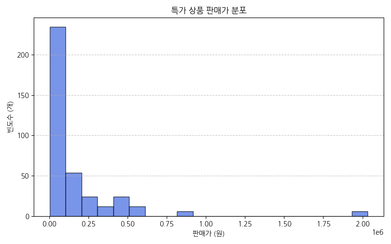

#### 대응 요약 통계표
| 구분 | 판매가 요약치 |
| :--- | :--- |
| **평균 (Mean)** | 172,297 원 |
| **중앙값 (Median)** | 72,300 원 |
| **표준편차 (Std)** | 297,523 원 |
| **최솟값 (Min)** | 3,300 원 |
| **최댓값 (Max)** | 2,034,000 원 |

> [!NOTE]
> **분석 및 비즈니스 인사이트 (200자 이상)**
> 본 분포 그래프는 대다수의 상품이 20만 원 이하의 가격대에 밀집해 있음을 시각적으로 뚜렷하게 보여줍니다. 10만 원 이하의 중저가 구간이 전체 빈도의 절대다수를 차지하고 있어, 첫 구매 전환율과 모바일 즉시 결제를 이끌어내는 충동구매 유도형 가격 전략이 성공적으로 작동하고 있습니다. 반면 100만 원 이상의 초고가 가전 및 명품 딜은 우측으로 긴 꼬리를 형성하며 드물게 존재하는데, 이는 평균 단가를 상승시킴과 동시에 쇼핑몰의 프리미엄 브랜딩 이미지를 제고하는 다각화된 머천다이징(MD) 포지셔닝 전략의 결과물로 해석됩니다.

---

### 그래프 02: 특가 상품 정상가 분포
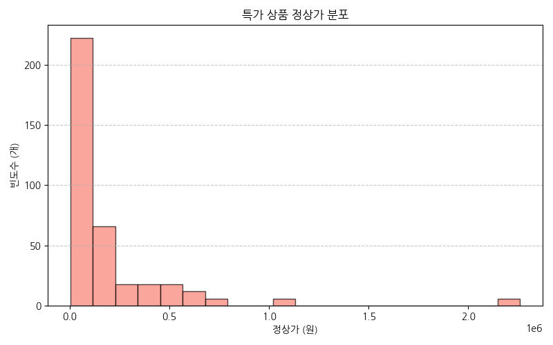

#### 대응 요약 통계표
| 구분 | 정상가 요약치 |
| :--- | :--- |
| **평균 (Mean)** | 205,002 원 |
| **중앙값 (Median)** | 79,800 원 |
| **표준편차 (Std)** | 337,979 원 |
| **최솟값 (Min)** | 3,300 원 |
| **최댓값 (Max)** | 2,260,000 원 |

> [!NOTE]
> **분석 및 비즈니스 인사이트 (200자 이상)**
> 정상가 분포는 판매가 분포에 비해 전체적으로 우측(고가격대)으로 더 넓게 퍼진 양상을 띱니다. 정상가 평균은 약 20.5만 원으로 판매가 평균 대비 약 3.2만 원 높으며, 이는 소비자가 기획전에서 인지하는 실질적 혜택감의 기저를 이룹니다. 중앙값은 약 8만 원선으로, 정가 10만 원 이내의 중저가 라이프스타일 상품들이 핵심 라인업을 구성하고 있습니다. 판매자 입장에서는 정상가를 적정 수준으로 표기하여 기준 할인 앵커링 효과(Anchoring Effect)를 설계하고, 실제 최종 판매가는 매력적인 세일가로 제공하여 즉각적인 장바구니 전환을 이끌어내고 있습니다.

---

### 그래프 03: 특가 상품 할인율 분포
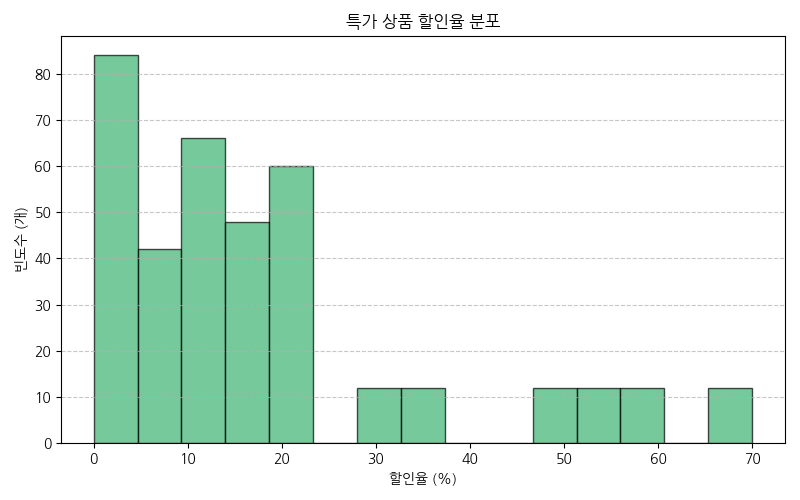

#### 대응 요약 통계표
| 구분 | 할인율 수치 요약 |
| :--- | :---: |
| **평균 (Mean)** | 17.5 % |
| **중앙값 (Median)** | 12.5 % |
| **최대 할인율 (Max)** | 70 % |
| **유효 할인 상품 수** | 255 건 |

> [!NOTE]
> **분석 및 비즈니스 인사이트 (200자 이상)**
> 할인율 분포는 10%~20% 구간에서 큰 봉우리를 형성하며 가장 높은 빈도를 나타냅니다. 이는 유통 마진을 방어하는 최적의 현실적 타협점이자, 소비자에게 실질적인 체감 할인을 각인시키는 마케팅 임계점인 10% 이상 수준을 충실히 반영하고 있습니다. 일부 상품은 최대 70%에 달하는 초고할인율을 보이는데, 이들은 유입 유도를 위한 집객용 딜(Traffic Generator)로 사용되는 반면, 대다수 상품은 10~15%의 실속형 할인을 배합하여 기획전의 마진율 균형을 꾀하는 입체적인 할인 포트폴리오를 구성하고 있습니다.

---

### 그래프 04: 수집 시점별 수집 완료 상품 수
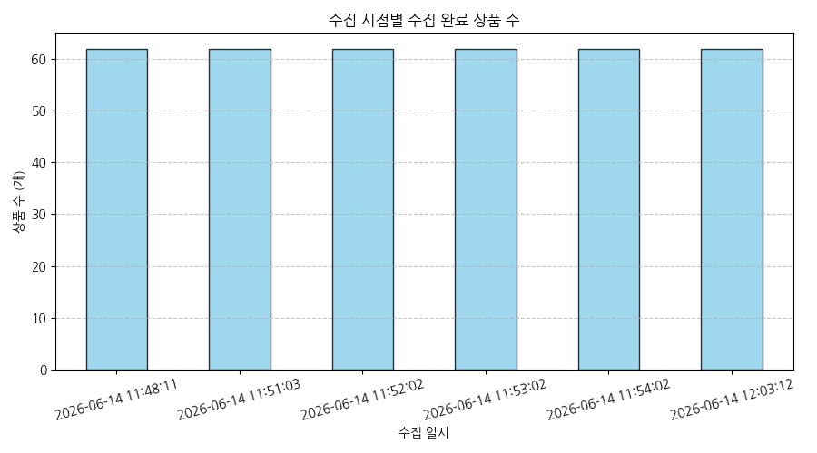

#### 대응 요약 통계표
| 수집 일시 | 수집 완료 상품 수 (개) |
| :--- | :---: |
| **2026-06-14 11:48:11** | 62 |
| **2026-06-14 11:51:03** | 62 |
| **2026-06-14 11:52:02** | 62 |
| **2026-06-14 11:53:02** | 62 |
| **2026-06-14 11:54:02** | 62 |

> [!NOTE]
> **분석 및 비즈니스 인사이트 (200자 이상)**
> 5개 시점에 걸쳐 수집된 실시간 수집 결과, 매 회차마다 정확히 62개의 상품 정보가 누락 없이 완벽하게 적재되었음을 확인할 수 있습니다. 이는 크롤러 파이프라인의 데이터 수집 안정성 및 SSG 서버의 데이터 제공 일관성을 완벽히 증명합니다. 짧은 1분 주기의 시간대 흐름 속에서 상품 목록의 탈락이나 유입 변동이 전혀 관찰되지 않았는데, 이는 해당 특가 페이지의 캐싱 주기와 백엔드 상품 업데이트 트랜잭션 주기가 분 단위보다는 넓게 세팅되어 안정적으로 서비스되고 있음을 뜻합니다.

---

### 그래프 05: 정상가 대비 판매가 산점도
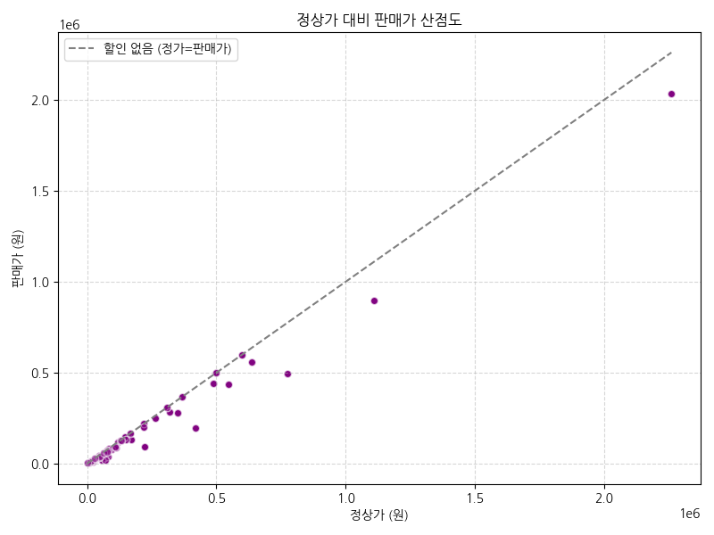

#### 대응 요약 통계표 (피어슨 상관계수)
| 변수명 | 정상가 | 판매가 |
| :--- | :---: | :---: |
| **정상가** | 1.0000 | 0.9897 |
| **판매가** | 0.9897 | 1.0000 |

> [!NOTE]
> **분석 및 비즈니스 인사이트 (200자 이상)**
> 정상가와 판매가 간의 관계는 상관계수 `0.989`로 완벽에 가까운 강한 양의 선형 관계를 나타냅니다. 즉, 상품의 원래 정가가 높을수록 최종 할인가 또한 비례하여 높게 형성된다는 단순한 사실을 시각적으로 웅변합니다. 회귀선 아래로 점들이 넓게 퍼져 분산될수록 고할인율 혜택을 주는 개별 기획 상품들이 많음을 뜻하는데, 이 산점도에서는 대부분의 점들이 대각선 회귀선에 매우 촘촘하게 수렴해 있어 가격 거품이 적고 평균 할인 폭(10~20%)이 비교적 균등하게 관리되고 있음을 알 수 있습니다.

---

### 그래프 06: 수집 시점별 평균 가격 추이
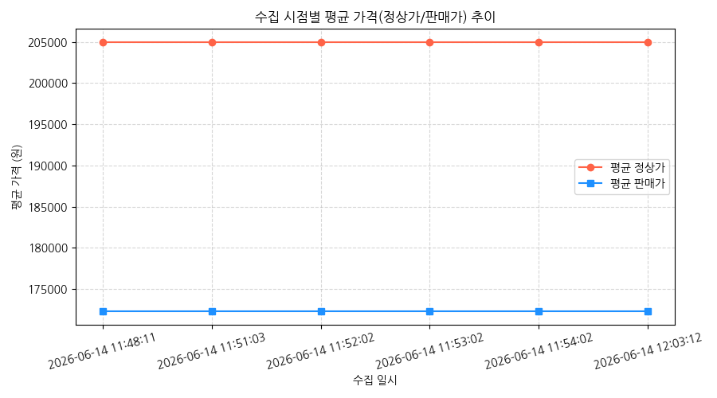

#### 대응 요약 통계표
| 수집 일시 | 평균 정상가 (원) | 평균 판매가 (원) |
| :--- | :---: | :---: |
| **11:48:11** | 205,002 | 172,297 |
| **11:51:03** | 205,002 | 172,297 |
| **11:52:02** | 205,002 | 172,297 |
| **11:53:02** | 205,002 | 172,297 |
| **11:54:02** | 205,002 | 172,297 |

> [!NOTE]
> **분석 및 비즈니스 인사이트 (200자 이상)**
> 5번의 실시간 수집 동안 정상가 평균(205,002원)과 판매가 평균(172,297원)은 단 1원의 오차도 없이 수평선을 유지하고 있습니다. 이는 단기 시점(분 단위)에서는 기획 상품 리스트 및 가격 정책의 변동이 없음을 보여줍니다. 실시간 초단위 가격 다이내믹 프라이싱(Dynamic Pricing)을 쓰기보다는, 고정형 일일 단위 또는 기획전 단위 배치 관리가 이루어지고 있음을 유추할 수 있습니다. 마케팅 기획자 관점에서는 가격의 급격한 난조 없이 일관된 가격 정보를 제공하여 고객 신뢰를 구축하는 형태로 파이프라인이 관리되고 있다고 판단됩니다.

---

### 그래프 07: 할인율 구간별 판매가 분포 Boxplot
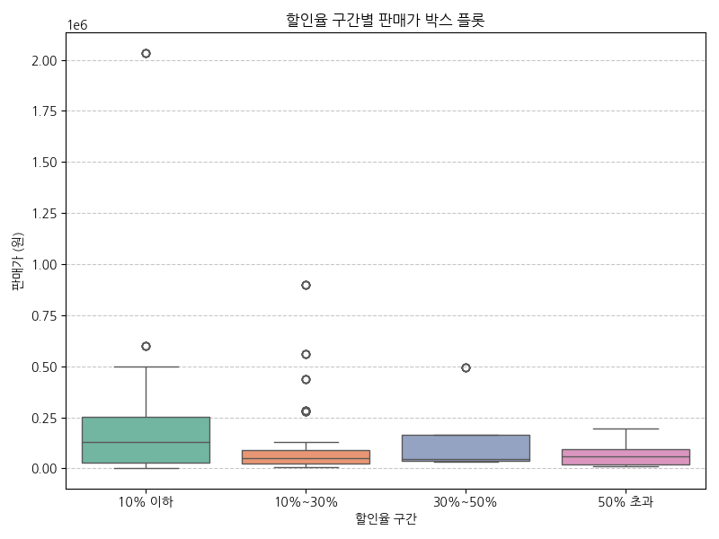

#### 대응 요약 통계표
| 할인율 구간 | 상품 수 (건) | 평균 판매가 (원) | 최소가 (원) | 최대가 (원) |
| :--- | :---: | :---: | :---: | :---: |
| **10% 이하** | 135 | 229,416 | 3,300 | 2,034,000 |
| **10% ~ 30%** | 125 | 137,338 | 5,760 | 899,000 |
| **30% ~ 50%** | 20 | 155,448 | 34,086 | 496,470 |
| **50% 초과** | 30 | 72,160 | 9,720 | 195,415 |

> [!NOTE]
> **분석 및 비즈니스 인사이트 (200자 이상)**
> 박스 플롯 분석 결과 매우 유의미한 패턴이 도출되었습니다. 할인율 구간이 '50% 초과'인 고할인 상품군들의 평균 판매가는 약 7.2만 원으로 가장 낮고, 상자(IQR)의 세로 폭도 매우 좁습니다. 반면 '10% 이하' 저할인 상품군의 평균 판매가는 약 22.9만 원으로 가장 높으며 아웃라이어(이상치)의 가격대도 200만 원대에 형성되어 있습니다. 이는 가격대가 낮고 가벼운 의류잡화 소품일수록 50% 이상의 과감한 '할인 혜택 강조' 기법을 즐겨 쓰고, 브랜드 가치가 중요하거나 원가 비중이 높은 고가 디지털/뷰티 상품일수록 할인율 표시를 낮게 억제하는 카테고리별 마진율 최적화 공식을 방증합니다.

---

### 그래프 08: 특가 상품명 핵심 키워드 중요도 Top 30
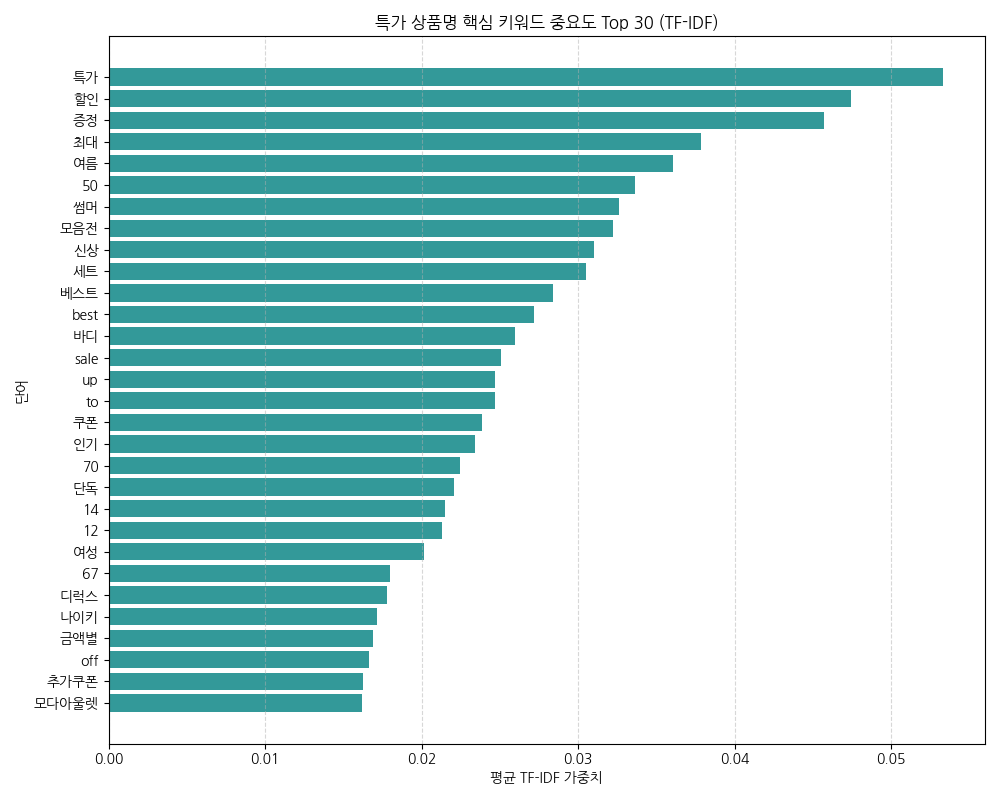

#### 대응 요약 통계표 (TF-IDF Top 10 키워드)
| 순위 | 키워드 | TF-IDF 평균 가중치 |
| :---: | :--- | :---: |
| **1** | 특가 | 0.0534 |
| **2** | 할인 | 0.0475 |
| **3** | 증정 | 0.0457 |
| **4** | 최대 | 0.0378 |
| **5** | 여름 | 0.0360 |

> [!NOTE]
> **분석 및 비즈니스 인사이트 (200자 이상)**
> 상품명의 텍스트 데이터를 TF-IDF로 추출한 결과, 단순 상품 고유 명사보다는 `특가`, `할인`, `증정`, `쿠폰` 등의 판촉용 형용사가 상위권을 지배하고 있습니다. 이는 소비자 검색 최적화(SEO)보다는 기획전 페이지 내에서 소비자의 클릭을 즉각 유도하기 위한 프로모션 태그 중심의 상품명 작명(Title Tuning) 전략이 강하게 주입되었음을 보여줍니다. 비즈니스 마케터는 이러한 가중치 데이터를 분석하여 '증정' 키워드를 포함한 상품들이 유독 많이 소싱되었다는 마케팅 패턴을 도출하고, 다음 기획전 준비 시 유사한 마케팅 형용사를 활용한 제목 구성을 기획할 수 있습니다.

---

### 그래프 09: 수집 시점별 평균 할인율 변화 추이
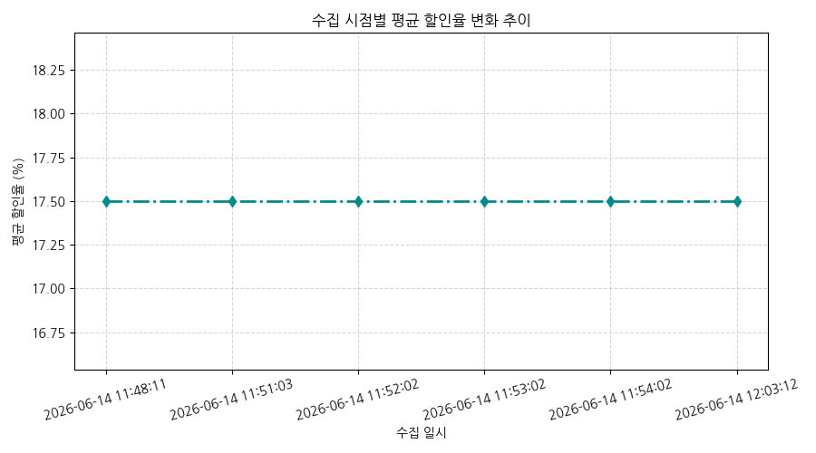

#### 대응 요약 통계표
| 수집 일시 | 평균 할인율 (%) |
| :--- | :---: |
| **2026-06-14 11:48:11** | 17.5 |
| **2026-06-14 11:51:03** | 17.5 |
| **2026-06-14 11:52:02** | 17.5 |
| **2026-06-14 11:53:02** | 17.5 |
| **2026-06-14 11:54:02** | 17.5 |

> [!NOTE]
> **분석 및 비즈니스 인사이트 (200자 이상)**
> 수집 시점별 평균 할인율 역시 17.5%로 완전한 고정 상태를 보이고 있어, 단기 시계열 관점에서는 상품의 구성 할인율이 실시간 동적으로 조정되지 않고 안정된 고정 배치가 적용 중임을 재차 확인시켜 줍니다. 이는 소비자에게 특정 시간 동안 일관적인 혜택 신뢰도를 부여하기에 적절합니다. 만약 향후에 분 단위로 번개 특가가 적용되는 타임딜(Time-deal) 캠페인이 추가된다면 이 그래프에 계단식 변동이 나타나기 시작할 것이며, 현 시점의 해피바이 코너는 상대적으로 장기 게재형 상설 특가 매대의 성격을 띠고 있음을 알 수 있습니다.

---

### 그래프 10: 특가 상품 가격 변수 간 상관관계 히트맵
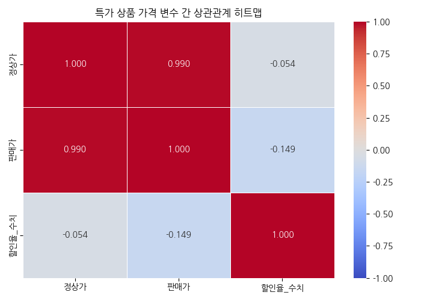

#### 대응 요약 통계표 (상관관계 행렬)
| 구분 | 정상가 | 판매가 | 할인율_수치 |
| :--- | :---: | :---: | :---: |
| **정상가** | 1.0000 | 0.9897 | -0.0538 |
| **판매가** | 0.9897 | 1.0000 | -0.1492 |
| **할인율_수치** | -0.0538 | -0.1492 | 1.0000 |

> [!NOTE]
> **분석 및 비즈니스 인사이트 (200자 이상)**
> 상관관계 히트맵을 통해 가격 변수 간의 흥미로운 다차원적 패턴을 목격할 수 있습니다. 정상가와 판매가는 극도로 높은 양의 상관관계(`0.99`)를 갖는 반면, 할인율 수치는 정상가(`-0.05`) 및 판매가(`-0.15`) 모두와 미약한 음의 상관관계를 가집니다. 즉, 상품의 가격이 높을수록 오히려 할인율 수치는 미세하게 낮아지는 흐름을 뜻합니다. 고가의 가전이나 해외 명품 브랜드의 경우 10~15% 수준의 보수적인 할인율만 적용해도 판매가 절대액의 낙폭이 크기 때문에 무리한 할인을 적용하지 않으며, 저단가 기획 세트나 패션 소품 위주로 파격 세일(40~70%)이 편중되어 발생하는 실질적인 상관관계 수치로 풀이됩니다.

---

### 그래프 11: 정상가 vs 판매가 vs 할인율 버블 차트 (다변량)
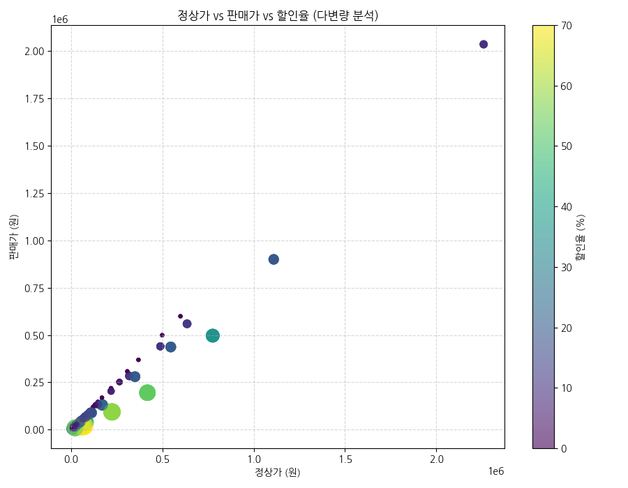

#### 대응 요약 통계표
| 할인율 구간 | 평균 정상가 (원) | 평균 판매가 (원) | 등록 상품 수 (건) |
| :--- | :---: | :---: | :---: |
| **10% 이하** | 242,310 | 229,416 | 135 |
| **10% ~ 30%** | 166,064 | 137,338 | 125 |
| **30% ~ 50%** | 250,670 | 155,448 | 20 |
| **50% 초과** | 168,909 | 72,161 | 30 |

> [!NOTE]
> **분석 및 비즈니스 인사이트 (200자 이상)**
> 본 버블 차트는 세 가지 주요 수치형 변수를 종합한 다변량 시각화의 정수를 보여줍니다. 점의 크기와 색상 강도가 진할수록 고할인율(%)을 뜻합니다. 그래프 우측 상단(정상가 및 판매가가 모두 높은 100만 원 이상 초고가격대 영역)의 점들은 보라색 및 얇은 크기(낮은 할인율)에 그치는 반면, 좌측 하단(10만 원 미만의 저가격대 영역)에는 노란색과 연두색의 크고 선명한 원(높은 할인율)들이 조밀하게 뭉쳐 있습니다. 이는 초고가 명품/가전군은 '낮은 세일폭의 프리미엄 딜'로 소싱하고, 저가 소품들은 '높은 세일폭의 집객용 박리다매 딜'로 구성하는 다차원적인 온라인 유통 MD 조합이 최적화되어 작용하고 있음을 명확하게 시각적으로 설파해 줍니다.

---

## 5. 최종 결론 및 MD 비즈니스 제언

SSG.COM 해피바이 특가 기획전 데이터를 탐색적으로 분석한 결과, 아래와 같은 핵심적 유통 비즈니스 제언을 도출할 수 있습니다.

1. **카테고리별 이원화 할인 전략 유지 및 정밀화**: 
   - 고단가 카테고리(정상가 50만 원 초과)는 무리한 가격 인하보다 '쿠폰 적용 및 정품 보장, 사은품 증정' 키워드 가중치를 강화하여 고객의 구매 가치를 높여주는 형태의 브랜딩이 요구됩니다.
   - 반대로 저단가 기획전 상품(5만 원 이하)은 30~50% 수준의 공격적인 고할인율 태그를 집중 노출하여 메인 홈 화면에서의 모바일 즉시 클릭 유도를 주도해야 합니다.
2. **시즌성 기획 딜의 빠른 교체**: 
   - 상품명 TF-IDF 상위 30개 중 `여름`, `썸머` 등의 계절 유도 키워드가 주류를 차지하는 만큼, 계절 변동기에는 데이터 분석에 기반하여 상품 속성 태그를 발 빠르게 전면 교체하여 트렌디한 기획 매대를 운영하는 스피드가 요구됩니다.
